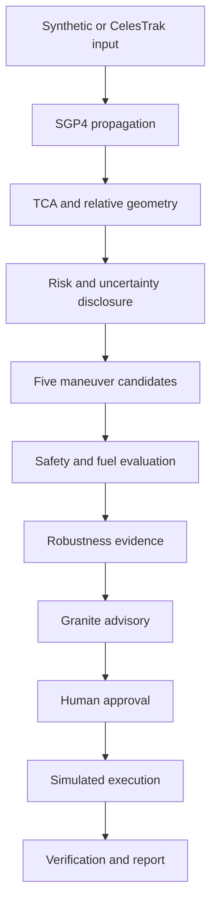
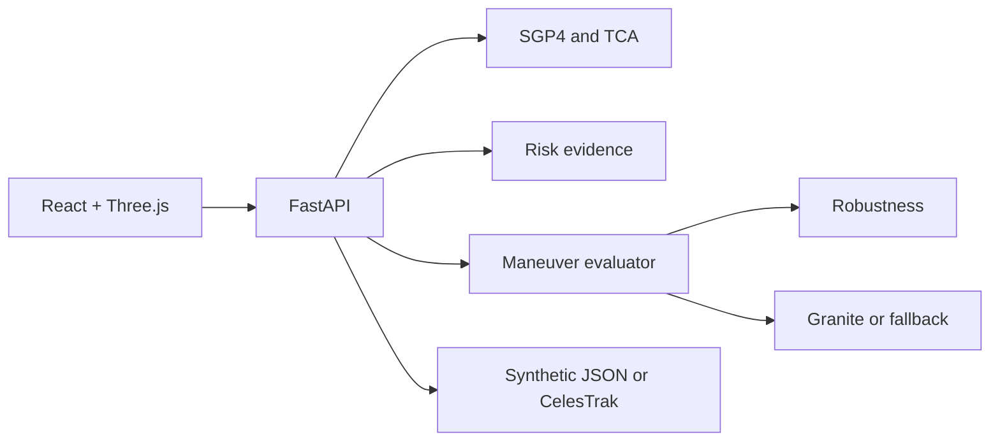

<div align="center">

# 🛰️ CollisionGuard AI

### Explainable, human-supervised collision-avoidance decision support for low-Earth orbit

**SGP4 physics · Live CelesTrak data · IBM Granite advisory · Three.js mission control**

[](#ibm-ai-builders-challenge)
[](#scientific-foundation)
[](#ibm-granite--with-strict-authority-limits)
[](#responsible-use)

</div>

> [!CAUTION]
> **SIMULATION ONLY — NOT FLIGHT SOFTWARE**  
> CollisionGuard AI is a hackathon decision-support prototype. It is not autonomous, certified, flight-ready, or suitable for operational spacecraft control. Every maneuver requires explicit human approval and is executed only in simulation.

---

## Table of Contents

- [The Problem](#the-problem)
- [Our Solution](#our-solution)
- [How It Works](#how-it-works)
- [What Makes It Different](#what-makes-it-different)
- [Mission-Control Experience](#mission-control-experience)
- [Scientific Foundation](#scientific-foundation)
- [IBM Granite](#ibm-granite--with-strict-authority-limits)
- [System Architecture](#system-architecture)
- [Data Modes](#data-modes)
- [Quick Start](#quick-start)
- [Judge Demo](#recommended-judge-demo)
- [Validation](#validation)
- [Limitations](#known-limitations)
- [Team](#team)

---

# The Problem

Low-Earth orbit is increasingly congested. When a satellite and another tracked object approach one another, an operator must quickly determine:

- **When** will closest approach occur?
- **How close** will the objects pass?
- **How fast** are they moving relative to one another?
- **What uncertainty** supports the risk estimate?
- **Which maneuver** improves safety without excessive fuel use?
- **Is the recommendation robust, explainable, and reviewable?**

The real challenge is not drawing two orbit lines. It is transforming orbital data into a defensible decision while preserving scientific transparency and human authority.

---

# Our Solution

CollisionGuard AI provides one end-to-end conjunction-response workspace.

Given exactly two LEO objects—a protected satellite and one threat object—it:

1. Ingests a committed synthetic scenario or public CelesTrak GP elements.
2. Propagates both objects using **SGP4**.
3. Finds the **time of closest approach (TCA)**.
4. Computes **miss distance** and **relative velocity**.
5. Discloses the data source, age, covariance availability, and estimate basis.
6. Generates five bounded candidate avoidance maneuvers.
7. Re-propagates and evaluates each candidate for safety, fuel, and separation.
8. Uses IBM Granite to rank and explain only backend-approved safe candidates.
9. Requires explicit human approval.
10. Simulates execution, verifies the outcome, and generates an incident report.

> **Core principle:** Deterministic software owns physics and safety. IBM Granite supports explanation and ranking. The human operator owns the decision.

---

# How It Works



| Stage | System output | Authority |
|---|---|---|
| Analyse | TCA, miss distance, relative velocity, risk basis | Deterministic backend |
| Review | Five evaluated maneuver candidates | Deterministic backend |
| Advise | Ranking and grounded explanation | Granite or labelled fallback |
| Approve | Explicit operator decision | Human operator |
| Simulate | Simulated maneuver result | Backend after revalidation |
| Verify | Post-maneuver safety result | Deterministic backend |
| Report | Grounded incident narrative | Granite or deterministic template |

---

# What Makes It Different

## 1. Physics and AI have separate authority

SGP4 propagation, TCA, miss distance, relative velocity, fuel, safety constraints, and post-maneuver results are computed outside the language model.

IBM Granite cannot:

- Invent orbital-mechanics values
- Change a backend-computed number
- Convert an unsafe candidate into a safe candidate
- Approve or execute a maneuver
- Bypass the operator

## 2. AI responses are numerically grounded

AI-provided numerical claims are checked against backend results before display. If they conflict, the backend remains authoritative and the response can expose a validation warning.

## 3. Uncertainty is visible

The system distinguishes between synthetic demonstration scenarios with labelled synthetic uncertainty and live CelesTrak public GP elements without operational covariance.

Live GP results are therefore labelled **screening-level estimates**, not operational collision probabilities.

## 4. Human approval is architectural

Approval is a required system state. The backend revalidates the selected maneuver before simulated execution.

## 5. The demo does not depend on external services

Committed conjunction and safe-pass scenarios keep the core workflow available when CelesTrak or watsonx.ai is unavailable.

---

# Mission-Control Experience

## Real 3D orbital visualization

The Three.js scene includes:

- Contextual 3D Earth
- Protected-satellite and threat/debris models
- Backend-derived protected and threat trajectory samples
- TCA markers and miss-distance connector
- Global, protected, threat, TCA, and reset camera views
- Hover-to-highlight trajectory discovery
- Click-to-pin interaction
- Keyboard-accessible controls and textual fallback

The production visualization does **not** generate frontend circular orbits. Trajectory coordinates come from the backend visualization contract.

> **Visual disclosure:** Object sizes may be enlarged for visibility. Earth geography is contextual unless explicitly transformed into the propagated frame.

## Operator evidence panels

The dashboard surfaces:

- Risk state and recommended action
- Miss distance, TCA, and relative velocity
- Source provenance, element epoch, and element age
- Covariance availability and estimate basis
- Maneuver safety, fuel, and post-maneuver separation
- Granite or deterministic-fallback source
- Approval, execution, verification, and reporting status

---

# Scientific Foundation

| Property | Implementation |
|---|---|
| Propagator | SGP4 |
| Coordinate frame | TEME |
| Scope | Two objects in LEO |
| TCA search | Bounded coarse search followed by numerical refinement |
| Miss distance | Relative position norm at TCA |
| Relative velocity | Difference of both SGP4 velocity vectors at TCA |
| Maneuvers | Five predefined bounded delta-v candidates |

## Honest risk language

The system does not display an unsupported bare confidence percentage. Risk output includes available evidence such as:

- Provider and retrieval time
- Orbital-element epoch and age
- Covariance availability or synthetic uncertainty basis
- Coordinate frame
- Robustness trial count and fraction, when actually executed

NASA CARA probability tiers may be referenced as guidance only. CollisionGuard AI is not certified against NASA operational procedures.

## Covariance boundary

Public CelesTrak GP data does not provide operational conjunction covariance. CollisionGuard AI does not fabricate it and does not present the resulting screening as an operational-grade probability of collision.

---

# IBM Granite — With Strict Authority Limits

IBM Granite via watsonx.ai performs meaningful decision-support work:

- Multi-factor ranking of safe maneuver alternatives
- Grounded risk and maneuver explanations
- Plain-language incident-report generation

```text
Unsafe candidate → backend rejects it → Granite never receives it
Safe candidate   → Granite may rank and explain it
Any candidate    → execution still requires human approval
```

When watsonx.ai is unavailable, the system uses a deterministic fallback and labels the source. The runtime model ID is configurable and reported by the application rather than hardcoded here.

---

# System Architecture



## Technology stack

| Layer | Technology |
|---|---|
| Frontend | React 18, Vite 5 |
| Visualization | Three.js, React Three Fiber, Drei |
| Backend | Python, FastAPI, Pydantic |
| Propagation | `sgp4` |
| AI | IBM Granite through watsonx.ai |
| Live data | CelesTrak OMM/JSON public GP elements |
| Testing | Pytest |

## Project structure

```text
CollisionGuard AI/
├── backend/
│   ├── data/scenarios/       # Guaranteed synthetic inputs
│   ├── routers/              # FastAPI routes
│   ├── schemas/              # Pydantic contracts
│   ├── tests/                # Focused and integration tests
│   ├── celestrak_client.py   # Public GP retrieval
│   ├── scenario_registry.py  # Runtime live scenarios
│   ├── propagation.py        # SGP4 and TCA
│   ├── maneuver_evaluator.py # Safety evaluation
│   ├── monte_carlo.py        # Explicit robustness evaluation
│   └── granite_client.py     # Granite guardrails and fallback
├── frontend/
│   ├── src/api/              # Backend client
│   ├── src/components/       # Dashboard and 3D scene
│   ├── src/App.jsx           # Workflow orchestration
│   └── src/styles.css        # Mission-control design system
├── docs/                     # Technical and submission evidence
├── .env.example
├── LICENSE
└── README.md
```

---

# Data Modes

## Synthetic Demo — Guaranteed Path

| Scenario | Purpose |
|---|---|
| `CONJ-001` | Close approach requiring maneuver review |
| `SAFE-001` | Safe pass requiring monitoring only |

Synthetic scenarios are labelled as:

- **Source:** Committed synthetic LEO demo scenario
- **Quality:** Demonstration data
- **Uncertainty:** Synthetic covariance
- **Operational use:** Simulation only—not operational tracking data

## Live CelesTrak — Additional Capability

Users enter two different NORAD catalog IDs. The backend fetches public GP elements, preserves provenance, registers the live scenario, and runs the same SGP4 analysis pipeline.

The UI reports provider, format, retrieval time, object names, catalog IDs, epochs, element ages, and covariance availability.

External requests may time out. The synthetic demo remains the recommended judging path.

---

# Quick Start

## Prerequisites

- Python 3.11+
- Node.js 20+
- npm and Git

## 1. Clone

```powershell
git clone https://github.com/MuskanEjaz/CollisionGuard-AI.git
cd "CollisionGuard-AI"
```

## 2. Configure and run the backend

```powershell
Copy-Item .env.example backend\.env
cd backend
python -m pip install -r requirements.txt
python -m uvicorn main:app --reload --host 127.0.0.1 --port 8000
```

- API: `http://127.0.0.1:8000`
- OpenAPI: `http://127.0.0.1:8000/docs`

The deterministic workflow works with blank watsonx values. For live Granite, configure only `backend/.env`:

```env
WATSONX_APIKEY=
WATSONX_PROJECT_ID=
WATSONX_URL=https://us-south.ml.cloud.ibm.com
WATSONX_MODEL_ID=
```

Never commit `.env`.

## 3. Run the frontend

Open a second terminal:

```powershell
cd frontend
npm install
npm run dev -- --host 127.0.0.1
```

Open `http://127.0.0.1:5173`.

---

# Recommended Judge Demo

Use `CONJ-001` as the guaranteed primary path:

1. Select **Synthetic Demo** and `CONJ-001`.
2. Run deterministic analysis.
3. Show both backend-derived trajectories and TCA geometry.
4. Explain miss distance, relative velocity, source, and uncertainty basis.
5. Compare the five maneuver candidates.
6. Show the Granite advisory or labelled fallback.
7. Select a safe maneuver.
8. Demonstrate mandatory human approval.
9. Execute the maneuver in simulation.
10. Show post-maneuver verification and incident report.
11. Briefly show `SAFE-001` and live CelesTrak.

> Do not make live CelesTrak the only demo path; public network access can fail or time out.

---

# Validation

Run validation against the final merged commit before publishing test counts.

## Frontend build

```powershell
cd frontend
npm run build
```

## Backend fast suite

```powershell
cd backend
python -m pytest tests -m "not slow"
```

## Explicit slow robustness test

```powershell
python -m pytest tests/test_monte_carlo.py -m slow -v
```

The slow test is intentionally separate. Do not run it during normal UI or documentation changes.

> Historical counts are not displayed as current badges because live-data and Three.js functionality was added afterward. Publish final numbers only after testing the final merged commit.

See [Testing](docs/TESTING.md) and [Current Status](docs/CURRENT_STATUS.md).

---

# API Reference

The OpenAPI specification at `http://127.0.0.1:8000/docs` is the authoritative route contract. Core workflows cover scenario analysis, CelesTrak retrieval, propagation, maneuvers, robustness, Granite advisory, cache invalidation, approval, simulated execution, and reporting.

See [API Reference](docs/API_REFERENCE.md).

---

# Known Limitations

- Exactly two objects are evaluated at a time.
- Scope is limited to LEO.
- CelesTrak public GP elements do not include operational covariance.
- Live network calls can time out.
- Maneuvers are predefined candidates, not globally optimized burns.
- Higher-fidelity operational force modelling is out of scope.
- Maneuver execution is simulated only.
- Object models are enlarged for visibility.
- Earth orientation is contextual unless explicitly frame-aligned.
- Runtime cache and live-scenario registry reset with the backend process.
- Authentication is not operational-grade.

---

# Responsible Use

CollisionGuard AI must not be used to command a spacecraft, replace certified flight-dynamics software, make operational collision-avoidance decisions, present public GP data as precision tracking data, present synthetic covariance as measured covariance, treat Granite as authoritative physics, or bypass human approval.

See [Safety and Responsible Use](docs/SAFETY_AND_RESPONSIBLE_USE.md).

---

# IBM AI Builders Challenge

CollisionGuard AI was built for the **IBM AI Builders Challenge — August 2026**, under the **Advance Space Exploration with AI** theme.

IBM technology contributes through Granite advisory ranking, grounded explanations, incident-report generation, numeric guardrails, and IBM Bob-assisted architecture, development, debugging, and documentation.

## Judging-Criteria Alignment

| Criterion | Project evidence |
|---|---|
| Challenge fit | Conjunction assessment and space sustainability |
| Technical execution | SGP4 pipeline, typed contracts, 3D visualization, safety gates |
| Meaningful IBM AI | Granite ranks and explains safe options under authority limits |
| Innovation | Grounded AI, human approval, post-maneuver verification |
| Feasibility | Laptop-runnable stack, offline scenarios, deterministic fallback |
| Responsible AI | Transparent uncertainty and no AI-generated physics |

---

# Documentation & Evidence

- [Architecture](docs/ARCHITECTURE.md)
- [API Reference](docs/API_REFERENCE.md)
- [Scientific Assumptions](docs/SCIENTIFIC_ASSUMPTIONS.md)
- [Safety and Responsible Use](docs/SAFETY_AND_RESPONSIBLE_USE.md)
- [Testing](docs/TESTING.md)
- [Current Status](docs/CURRENT_STATUS.md)
- [IBM Bob Usage](docs/IBM_BOB_USAGE.md)
- [Team Handoff](docs/TEAM_HANDOFF.md)
- [Demo Plan](docs/DEMO_VIDEO_PLAN.md)

## Final Evidence Checklist

- [ ] Full 3D conjunction scene
- [ ] TCA and risk evidence
- [ ] Maneuver comparison
- [ ] Granite or fallback badge
- [ ] Human approval and simulated execution
- [ ] Post-maneuver verification
- [ ] Incident report
- [ ] CelesTrak provenance
- [ ] Final build and test output
- [ ] Public demo-video link

---

# Team

| Member | Primary ownership |
|---|---|
| **Muskan Ejaz** | Product integration, UI, documentation, evidence, submission |
| **Pushkar** | IBM Granite integration, grounding, AI evidence |
| **Surya** | Backend validation, performance, robustness evidence, demo production |

---

# Demo Video

**Public demo:** `[ADD FINAL PUBLIC VIDEO URL]`

---

# Future Work

- Authorized conjunction data-message and covariance ingestion
- Independently validated probability-of-collision calculation
- Higher-fidelity force modelling
- Geometry-aware maneuver optimization
- Multi-object screening
- Persistent audit logs and authenticated operator roles
- Independent aerospace-software verification

These capabilities are future work and are not claimed as implemented.

---

# License

See [LICENSE](LICENSE).

---

<div align="center">

### Deterministic physics. Grounded IBM AI. Human authority.

CollisionGuard AI does not replace professional conjunction-assessment systems. It demonstrates an explainable and responsible path from orbital data to a human-supervised simulated decision.

</div>
