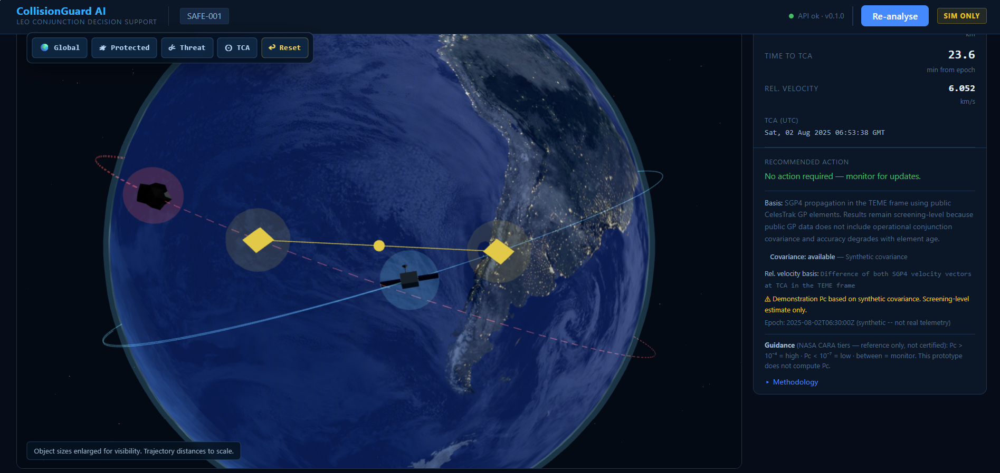
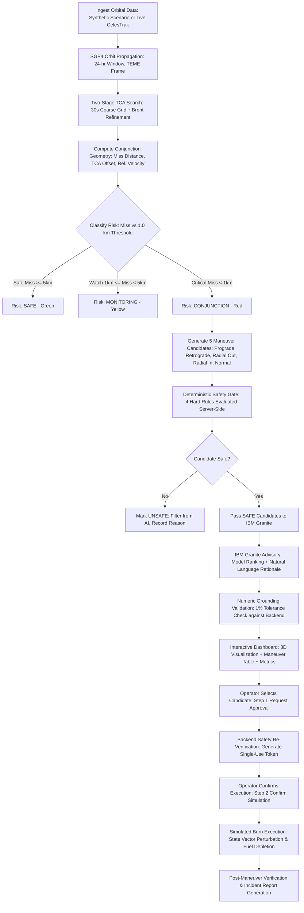
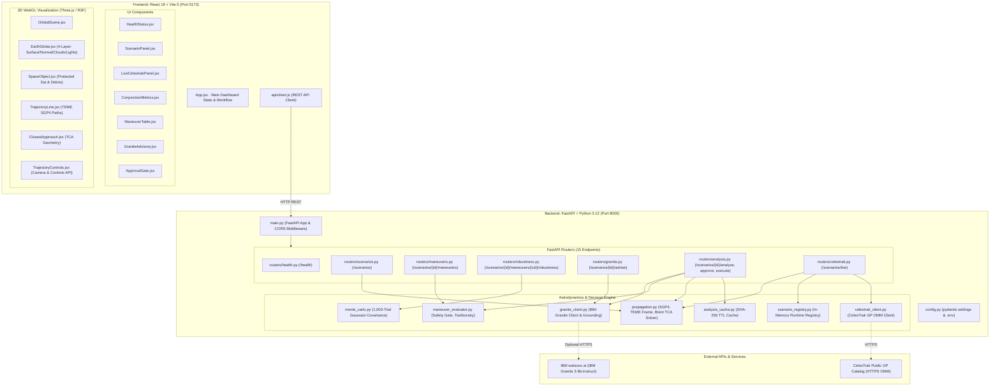

# CollisionGuard AI

<p align="center">
  
</p>

<h2 align="center">🎥 CollisionGuard AI — Demo Video</h2>

<p align="center">
  <a href="https://youtu.be/VqeQxbSCIq0">
    
  </a>
</p>

<p align="center">
  <i>See how CollisionGuard AI transforms orbital data into safer, explainable decisions.</i>
</p>

> **Autonomous Screening, Deterministic Safety, Human Authority:** An AI-powered Low Earth Orbit (LEO) conjunction decision-support system that provides satellite operators with physics-grounded collision risk assessment, candidate maneuver evaluation, IBM Granite advisory insights, and human-in-the-loop safety gates.

---

```
   _____      _ _ _     _             _____                  _          _____ 
  / ____|    | | (_)   (_)           / ____|                | |   /\   |_   _|
 | |     ___ | | |_ ___ _  ___  _ __| |  __ _   _  __ _ _ __| |  /  \    | |  
 | |    / _ \| | | / __| |/ _ \| '_ \ | |_ | | | |/ _` | '__| | / /\ \   | |  
 | |___| (_) | | | \__ \ | (_) | | | | |__| | |_| | (_| | |  | |/ ____ \ _| |_ 
  \_____\___/|_|_|_|___/_|\___/|_| |_|\_____|\__,_|\__,_|_|  |_/_/    \_\_____|
```

[](https://fastapi.tiangolo.com)
[](https://www.python.org/)
[](https://reactjs.org/)
[](https://vitejs.dev/)
[](https://threejs.org/)
[](https://www.ibm.com/products/watsonx-ai)
[](LICENSE)
[](#16-test-suite--verification-matrix)

---

## 1. Executive Summary & Value Proposition

**CollisionGuard AI** compresses the high-pressure orbital conjunction assessment and maneuver decision cycle from hours down to seconds. By coupling high-precision **SGP4 orbital propagation** in the **TEME reference frame** with a **two-stage Brent refinement Time of Closest Approach (TCA) search**, the system rapidly evaluates close approaches against hard safety thresholds.

Crucially, CollisionGuard AI pairs **IBM Granite (`ibm/granite-3-8b-instruct` via watsonx.ai)** generative advisory explanations with an uncompromised **deterministic safety gate**: every numerical claim from the AI is strictly validated against underlying orbital mechanics at a 1% tolerance, and Granite is architecturally forbidden from approving burns or altering safety classifications. The human operator remains in full command at every step.

> [!IMPORTANT]
> **Prototype & Simulation Disclaimer:** CollisionGuard AI is an advanced human-supervised decision-support prototype. It is built for simulation, screening, and research purposes. It is **not** autonomous flight control software and must not be used for direct operational spacecraft commanding without independent validation.

---

## 2. Why This Problem Matters

Low Earth Orbit (LEO) is experiencing an exponential increase in orbital density:
* **Over 27,000 tracked objects** larger than 10 cm and an estimated **1,000,000+ lethal debris fragments** (1–10 cm) travel at orbital velocities exceeding $7.5\text{ km/s}$ ($27,000\text{ km/h}$).
* Megaconstellations have increased conjunction warnings by an order of magnitude; satellite operations centers receive hundreds of Conjunction Data Messages (CDMs) weekly.
* **The Operator Bottleneck:** Flight dynamics operators face high cognitive load—manually reviewing propagation geometry, evaluating maneuver candidates, assessing fuel cost via the Tsiolkovsky rocket equation, checking secondary conjunctions, and drafting executive briefings under strict operational deadlines.
* **The Collision Risk:** A single hypervelocity collision can trigger the **Kessler Syndrome**, generating cascading debris fields that threaten vital space infrastructure.

---

## 3. Project Motivation & Space-Safety Context

CollisionGuard AI was developed for the **IBM AI Builders Challenge (Theme: Advance Space Exploration with AI)** to demonstrate how modern AI and deterministic astrodynamics can cooperate safely.

Space safety demands absolute mathematical certainty where physics is concerned, paired with clear contextual synthesis where human cognition is strained. CollisionGuard AI bridges this gap by assigning distinct roles:
1. **Deterministic Physics Layer:** SGP4 propagation, Brent refinement root-finding, state perturbation, rocket equation $\Delta v$ consumption, and pass/fail safety rules.
2. **Generative Intelligence Layer (IBM Granite):** Contextual synthesis, maneuver trade-off reasoning, and incident narrative generation.
3. **Human Authority:** Mandatory two-step cryptographic approval gate before any simulated command execution.

---

## 4. Key Features

- 🛰️ **High-Precision SGP4 Propagation:** Accurate orbit propagation using standardized NORAD Two-Line Element (TLE) and Orbit Mean-Elements Message (OMM) models in the True Equator, Mean Equinox (TEME) frame.
- ⏱️ **Two-Stage Brent TCA Solver:** High-speed 30-second coarse temporal grid sweep combined with Brent's refinement method achieving sub-second ($0.01\text{ s}$) temporal resolution.
- 🌐 **Interactive 3D WebGL Orbital Canvas:** Real-time Three.js / React Three Fiber visualization featuring a 4-layer Earth (day surface with normal map, rotating clouds, atmospheric Fresnel limb glow, night city lights), 3D satellite bus with solar panels and beacon, debris cluster with hazard hotspot, TEME trajectory paths, and TCA indicators.
- 🛡️ **Structural Deterministic Safety Gate:** Maneuver candidates are classified as safe/unsafe by 4 hard mathematical checks ($\Delta v$ budget, fuel mass, post-maneuver miss distance, positive improvement). Unsafe candidates are filtered out before reaching Granite.
- 🤖 **IBM Granite Advisory with Strict Grounding:** Evaluates safe maneuver options and provides structured operator rationale. Backend automatically detects numerical divergence at a 1% threshold and overrides hallucinated values.
- 🔄 **Deterministic Fallback Engine:** 100% functional offline or without IBM watsonx.ai credentials; gracefully degrades to mathematical scoring while preserving all UI and safety features.
- 🚀 **Live CelesTrak Integration:** On-demand live orbital element fetching via CelesTrak GP catalog with LEO validation and element-age provenance tracking.
- 🔒 **Two-Step Approval Gate:** Two-stage human verification workflow with single-use nonce tokens preventing replay attacks.
- 📊 **Monte Carlo Robustness Engine:** Real 1,000-trial Gaussian state covariance perturbation for maneuver resilience testing.

---

## 5. End-to-End Operational Workflow



---

## 6. Detailed Visualization & Dashboard Architecture

The frontend is an aerospace mission-console interface built with **React 18**, **Vite 5**, and **Three.js / React Three Fiber / Drei**:

```
+-----------------------------------------------------------------------------------------------+
| CollisionGuard AI   [CONJ-001] [LIVE CELESTRAK]          [● API OK · v0.1.0] [RE-ANALYSE] [SIM ONLY] |
+-----------------------------------------------------------------------------------------------+
| BACKEND SGP4 · TEME FRAME · TO SCALE | ⊙ FOCUS TCA | ↩ RESET VIEW                                    |
| [ Protected ] [ Threat ] [ TCA ] [ Maneuver ] [ ✕ Clear ]                                     |
+-------------------------------------------------------------+---------------------------------+
|                                                             | CONJUNCTION ALERT               |
|                      3D ORBITAL SCENE                       | Miss Distance: 0.0280 km        |
|                                                             | Time to TCA: 119.8 min          |
|   - 4-Layer Earth (Day Surface, Normal Map, Clouds, Lights) | Rel. Velocity: 9.842 km/s       |
|   - Protected Satellite (Silver Bus, Solar Wings, Blue Glow)| Conjunction Threshold: 1.000 km |
|   - Threat Debris (Metallic Facets, Red Danger Glow)        | TCA (UTC): 2025-08-01 13:59:45  |
|   - Solid Cyan Protected Trajectory Line                    +---------------------------------+
|   - Dashed Red Threat Trajectory Line                       | RECOMMENDED ACTION              |
|   - Solid Green Post-Maneuver Trajectory Line               | Review candidates and select.   |
|   - Gold Diamond TCA Marker & Distance Connector            +---------------------------------+
|   - Floating Camera Presets [Global | Protected | Threat | TCA] | DATA QUALITY & PROVENANCE       |
|                                                             | SGP4 TEME · Synthetic Covariance|
+-------------------------------------------------------------+---------------------------------+
| MANEUVER CANDIDATE EVALUATION TABLE (Ranked by Safety & Fuel Efficiency)                      |
| [Select] | Candidate | Type | Delta-V (m/s) | Fuel (kg) | Post-Miss (km) | Safety | Granite Rank |
+-----------------------------------------------------------------------------------------------+
| OPERATOR APPROVAL GATE: [ REQUEST SIMULATED EXECUTION ] -> [ CONFIRM BURN ]                   |
+-----------------------------------------------------------------------------------------------+
```

### Visualization Components
1. **Earth Globe (`EarthGlobe.jsx`):** Renders Earth at true visual scale with high-resolution daytime surface imagery (`earth_daymap.jpg`), normal mapping for surface relief (`earth_normal_map.jpg`), a semi-transparent rotating cloud sphere (`earth_clouds.jpg`), additive nighttime city lights on the dark side of the terminator (`earth_nightmap.jpg`), and an atmospheric Fresnel limb glow.
2. **Space Objects (`SpaceObject.jsx`):**
   - **Protected Satellite:** High-contrast metallic silver bus with gold thermal insulation panels, dual solar arrays with dark-blue photovoltaic cells, communication antenna, bright cyan center beacon, and a subtle blue ambient aura.
   - **Threat Debris:** Tumbling faceted metallic debris cluster with burnt-titanium specular highlights, a glowing red hazard hotspot, and a soft red danger perimeter glow.
3. **Orbital Trajectories (`TrajectoryLine.jsx`):** True-scale 3D paths rendered from backend SGP4 state vectors (Cyan solid line for protected asset, Red dashed line for threat, Green solid line for post-maneuver trajectory).
4. **Closest Approach (`ClosestApproach.jsx`):** Gold diamond marker placed at the conjunction point with connecting geometry representing the minimum miss distance vector.
5. **Camera System & Overlay Controls (`TrajectoryControls.jsx`):** Smooth lerped camera transitions between presets (`Global`, `Protected`, `Threat`, `TCA`, `Reset`). Collinear radial scaling ensures overlay UI elements remain anchored without screen drift.

---

## 7. IBM Granite & AI Integration

### Where IBM Granite Is Used
CollisionGuard AI integrates **IBM Granite** (`ibm/granite-3-8b-instruct` via **watsonx.ai**) exclusively for **decision support and contextual synthesis**:
1. **Maneuver Advisory Ranking (`POST /scenarios/{id}/advise`):** Analyzes the trade-offs among pre-filtered *safe* maneuver candidates, considering propellant consumption, post-maneuver separation geometry, and operational lead time.
2. **Incident Narrative Generation (`POST /scenarios/{id}/incident-report`):** Generates structured executive summaries and technical incident reports following a simulated maneuver.

### Strict Boundaries & Anti-Hallucination Guardrails
To prevent AI hallucinations from impacting safety-critical orbital decisions, CollisionGuard AI implements hard architectural constraints:

```
                  +---------------------------------------+
                  | Evaluated Maneuver Candidates (1 to 5)|
                  +---------------------------------------+
                                      |
                                      v
                  +---------------------------------------+
                  |      DETERMINISTIC SAFETY GATE        |
                  |  1. Delta-V <= 3.0 m/s                |
                  |  2. Fuel <= 5.0 kg                    |
                  |  3. Post-Maneuver Miss >= 5.0 km      |
                  |  4. Miss Improvement >= 1.0 km        |
                  +---------------------------------------+
                                 /         \
                 [REJECTED/UNSAFE]         [SAFE CANDIDATES]
                        /                           \
                       v                             v
           +-----------------------+     +-----------------------+
           | Marked is_safe = False|     | Passed to IBM Granite |
           | NEVER SENT TO GRANITE |     | Prompt with Physics   |
           +-----------------------+     +-----------------------+
                                                     |
                                                     v
                                         +-----------------------+
                                         | IBM Granite Advisory  |
                                         | Generates JSON Output |
                                         +-----------------------+
                                                     |
                                                     v
                                         +-----------------------+
                                         |   NUMERIC GROUNDING   |
                                         |      GUARDRAIL        |
                                         |  Tolerance Check: 1%  |
                                         +-----------------------+
                                            /                 \
                                   [Within 1%]           [Mismatch > 1%]
                                       /                         \
                                      v                           v
                          +--------------------+      +--------------------+
                          | Accept AI advisory |      | Override with True |
                          | text and ranking   |      | Backend Physics;   |
                          |                    |      | Log Warning Note   |
                          +--------------------+      +--------------------+
```

### Deterministic Fallback Mode
If IBM watsonx.ai credentials (`WATSONX_APIKEY`, `WATSONX_PROJECT_ID`, `WATSONX_URL`) are not configured or the network is unavailable:
- The system automatically engages the built-in deterministic fallback engine (`source="deterministic_fallback"`).
- Candidates are ranked using a multi-criteria scoring algorithm balancing miss distance improvement and fuel expenditure.
- The UI clearly labels the advisory provenance with a `FALLBACK` badge so the operator always knows the advisory source.

---

## 8. Technical Architecture



---

## 9. Repository Structure

```
CollisionGuard-AI/
├── .env.example                          # Environment variable configuration template
├── .gitignore                            # Git exclusion rules
├── LICENSE                               # MIT License
├── README.md                             # Primary project documentation
├── backend/
│   ├── main.py                           # FastAPI application entry point & CORS
│   ├── config.py                         # Settings management via pydantic-settings
│   ├── requirements.txt                  # Python dependencies
│   ├── pytest.ini                        # Pytest configuration and markers
│   ├── propagation.py                    # SGP4 propagation, TEME coords & Brent TCA solver
│   ├── maneuver_candidates.py            # Maneuver candidate definitions (5 directions)
│   ├── maneuver_evaluator.py             # Deterministic safety gate & fuel evaluation
│   ├── monte_carlo.py                    # Gaussian state covariance robustness engine (1,000 trials)
│   ├── granite_client.py                 # IBM Granite client, grounding & fallback logic
│   ├── granite_smoke_test.py             # Standalone watsonx.ai integration smoke test
│   ├── celestrak_client.py               # CelesTrak GP orbital data client & LEO validator
│   ├── analysis_cache.py                 # In-memory SHA-256 keyed TTL analysis cache
│   ├── scenario_registry.py              # Dynamic scenario registry for live scenarios
│   ├── data/
│   │   └── scenarios/                    # Baseline scenario definitions
│   │       ├── conjunction_scenario.json # Critical conjunction scenario (CONJ-001)
│   │       └── safe_scenario.json        # Safe separation scenario (SAFE-001)
│   ├── routers/                          # API endpoint controllers (15 routes)
│   │   ├── health.py                     # Health check router
│   │   ├── scenarios.py                  # Scenario listing and propagation router
│   │   ├── maneuvers.py                  # Candidate retrieval and evaluation router
│   │   ├── robustness.py                 # Monte Carlo robustness router
│   │   ├── granite.py                    # Standalone Granite advisory router
│   │   ├── analysis.py                   # Full pipeline, approval, execution router
│   │   └── celestrak.py                  # Live CelesTrak import and screening router
│   ├── schemas/                          # Pydantic v2 data models
│   │   ├── health.py                     # Health models
│   │   ├── scenario.py                   # Scenario, TLE, SpaceObject models
│   │   ├── maneuver.py                   # Maneuver candidate & evaluation models
│   │   ├── monte_carlo.py                # Robustness request & response models
│   │   ├── granite.py                    # Granite advisory and narrative schemas
│   │   ├── analysis.py                   # Analysis, approval, execution schemas
│   │   └── celestrak.py                  # CelesTrak request & provenance schemas
│   └── tests/                            # Comprehensive Pytest test suite (10 modules)
│       ├── test_analysis.py              # Full pipeline, approval, and execution tests
│       ├── test_celestrak.py             # CelesTrak client and live pipeline tests
│       ├── test_cors.py                  # CORS preflight header validation tests
│       ├── test_granite.py               # Granite advisory, fallback & grounding tests
│       ├── test_health.py                # Health endpoint tests
│       ├── test_maneuver_evaluator.py    # Safety gate, fuel & ranking tests
│       ├── test_monte_carlo.py           # Robustness perturbation tests (incl. 1000 trials)
│       ├── test_propagation.py           # SGP4 & Brent TCA precision tests
│       ├── test_scenarios.py             # Scenario loading and TLE validation tests
│       └── test_visualization_contract.py# Visualization data contract tests
├── frontend/
│   ├── package.json                      # Frontend dependencies (React, Vite, Three.js)
│   ├── vite.config.js                    # Vite build configuration
│   ├── index.html                        # Application entry HTML
│   ├── public/
│   │   └── assets/
│   │       └── earth/                    # High-resolution Earth texture maps
│   │           ├── earth_daymap.jpg      # Daytime continent and ocean imagery
│   │           ├── earth_nightmap.jpg    # Nighttime urban city lights map
│   │           ├── earth_clouds.jpg      # Global cloud pattern layer
│   │           └── earth_normal_map.jpg  # Surface relief elevation normal map
│   └── src/
│       ├── main.jsx                      # React DOM root entry
│       ├── App.jsx                       # Master console view & workflow state
│       ├── styles.css                    # Mission-control aerospace design system
│       ├── api/
│       │   └── client.js                 # Unified fetch API client
│       └── components/                   # Modular React components
│           ├── HealthStatus.jsx          # Real-time backend connectivity badge
│           ├── ScenarioPanel.jsx         # Scenario selector & metadata cards
│           ├── LiveCelestrakPanel.jsx    # Live NORAD catalog query panel
│           ├── ConjunctionMetrics.jsx    # Risk level banner & primary encounter metrics
│           ├── ManeuverTable.jsx         # Evaluated candidate table with Granite rank
│           ├── GraniteAdvisory.jsx       # AI recommendations, provenance & warnings
│           ├── ApprovalGate.jsx          # Human authorization & simulated execution
│           ├── TrajectoryPlot.jsx        # 3D canvas wrapper, legend, toolbar & status
│           ├── OrbitalScene.jsx          # Three.js scene graph composition
│           ├── EarthGlobe.jsx            # 4-layer procedural & textured 3D Earth
│           ├── SpaceObject.jsx           # 3D Satellite and Debris models with glows
│           ├── TrajectoryLine.jsx        # WebGL orbital path geometry (TEME)
│           ├── ClosestApproach.jsx       # TCA diamond marker & miss vector line
│           ├── TrajectoryControls.jsx    # Camera controller & floating preset overlay
│           └── TrajectoryTooltip.jsx     # Spatial 3D hover/pin tooltip overlay
└── docs/                                 # Detailed design & validation documentation
    ├── ARCHITECTURE.md                   # Deep-dive system architecture
    ├── API_REFERENCE.md                  # Comprehensive REST API specifications
    ├── SCIENTIFIC_ASSUMPTIONS.md         # Mathematical & physical models documentation
    ├── SAFETY_AND_RESPONSIBLE_USE.md     # Safety boundaries & ethical use statement
    ├── TESTING.md                        # Testing procedures and evidence log
    ├── IBM_BOB_USAGE.md                  # IBM Bob development log
    ├── TEAM_HANDOFF.md                   # Roles, responsibilities & merge orders
    ├── SUBMISSION_COPY.md                # Hackathon submission texts
    ├── CURRENT_STATUS.md                 # Implementation status tracking
    └── DEMO_VIDEO_PLAN.md                # 3-minute presentation script
```

---

## 10. Astrodynamics & Risk Methodology

### Orbital Propagation (SGP4)
Orbital propagation is performed using the standard **SGP4 (Simplified General Perturbations 4)** algorithm via the official `sgp4` library (version 2.27+).
- **Coordinate Reference Frame:** True Equator, Mean Equinox (TEME).
- **Time Window:** 24 hours ($86,400\text{ s}$) forward from the scenario epoch.
- **Julian Date Calculation:** Evaluated at exact UTC Julian dates (`jday(year, month, day, hour, minute, second)`).
- **Sampling:** Sampled every 30 seconds (2,880 discrete evaluations across the 24-hour horizon).

### Two-Stage Brent TCA Detection
Finding the exact Time of Closest Approach is formulated as finding the local minimum of the separation distance function:
$$d(t) = \|\mathbf{r}_{\text{protected}}(t) - \mathbf{r}_{\text{threat}}(t)\|$$

1. **Coarse Grid Scan:** Scans the 24-hour window at 30-second intervals to locate the interval $[t_{i-1}, t_{i+1}]$ containing the global minimum miss distance.
2. **Brent Refinement:** Applies **Brent's refinement method** within the bracketed interval:
   - Tolerance: $\text{tol} = 0.01\text{ seconds}$.
   - Max Iterations: 100.
   - Result: Sub-second accurate timestamp $t_{\text{TCA}}$ and precise minimum separation $d_{\text{min}}$.

### Relative Velocity Vector at TCA
At the computed $t_{\text{TCA}}$, velocity vectors $\mathbf{v}_{\text{protected}}$ and $\mathbf{v}_{\text{threat}}$ are extracted in the TEME frame:
$$\mathbf{v}_{\text{rel}} = \mathbf{v}_{\text{threat}}(t_{\text{TCA}}) - \mathbf{v}_{\text{protected}}(t_{\text{TCA}})$$
$$v_{\text{rel}} = \|\mathbf{v}_{\text{rel}}\|$$

### Conjunction Classification Hierarchy
- **Critical Conjunction (`CONJUNCTION` / Red):** $d_{\text{min}} < 1.0\text{ km}$. Immediate maneuver evaluation required.
- **Monitoring (`MONITORING` / Yellow):** $1.0\text{ km} \le d_{\text{min}} < 5.0\text{ km}$. Within watch volume; monitor for orbit updates.
- **Safe (`SAFE` / Green):** $d_{\text{min}} \ge 5.0\text{ km}$. Clear separation; no avoidance maneuver needed.

---

## 11. Maneuver Evaluation & The Deterministic Safety Gate

CollisionGuard AI evaluates 5 pre-configured candidate $\Delta v$ maneuvers along distinct orbital directions:

| ID | Candidate Name | Direction Vector $(\Delta v_x, \Delta v_y, \Delta v_z)\text{ m/s}$ | Burn Magnitude |
|---|---|---|---|
| `MANEUVER-01` | Prograde Burn (Speed Up) | $(+1.5, 0.0, 0.0)$ | $1.5\text{ m/s}$ |
| `MANEUVER-02` | Retrograde Burn (Slow Down) | $(-1.5, 0.0, 0.0)$ | $1.5\text{ m/s}$ |
| `MANEUVER-03` | Radial Outward | $(0.0, +1.0, 0.0)$ | $1.0\text{ m/s}$ |
| `MANEUVER-04` | Radial Inward | $(0.0, -1.0, 0.0)$ | $1.0\text{ m/s}$ |
| `MANEUVER-05` | Out-of-Plane (Cross-Track) | $(0.0, 0.0, +1.2)$ | $1.2\text{ m/s}$ |

### Fuel Consumption Model (Tsiolkovsky Rocket Equation)
Propellant mass consumption $\Delta m$ is calculated deterministically assuming a standard monopropellant hydrazine thruster ($I_{\text{sp}} = 220\text{ s}$, $g_0 = 9.80665\text{ m/s}^2$):
$$\Delta m = m_{\text{dry}} \cdot \left(e^{\frac{\|\Delta \mathbf{v}\|}{I_{\text{sp}} \cdot g_0}} - 1\right)$$

### The 4-Rule Deterministic Safety Gate
A maneuver candidate is marked `is_safe = True` if and only if **all four conditions** pass:
1. **$\Delta v$ Budget:** $\|\Delta \mathbf{v}\| \le 3.0\text{ m/s}$ (Maximum allowable single-burn budget).
2. **Propellant Margin:** $\Delta m \le 5.0\text{ kg}$ (Vehicle has sufficient propellant remaining).
3. **Safe Clearance:** $d_{\text{post-maneuver}} \ge 5.0\text{ km}$ (Post-burn miss distance exceeds the safe clearance threshold).
4. **Positive Improvement:** $d_{\text{post-maneuver}} - d_{\text{nominal}} \ge 1.0\text{ km}$ (The maneuver strictly improves separation by at least 1.0 km).

---

## 12. Monte Carlo Robustness Analysis

To evaluate how tracking uncertainties impact maneuver safety, the backend includes a Monte Carlo perturbation module (`monte_carlo.py`):
- **Uncertainty Model:** Gaussian perturbation applied to the initial state vector at epoch ($\sigma_r = 100\text{ m}$ for position, $\sigma_v = 0.01\text{ m/s}$ for velocity).
- **Execution:** Runs **1,000 real independent trials** (`N_TRIALS = 1000`).
- **Metrics Computed:**
  - Robustness Pass Rate (% of perturbed trials maintaining miss distance $> 5.0\text{ km}$).
  - Mean, Median, Min, Max, and Standard Deviation of perturbed miss distances.

---

## 13. Data Sources, Assumptions & Scientific Integrity

| Parameter / Aspect | Implementation / Assumption | Limitations & Provenance |
|---|---|---|
| **Orbital Model** | SGP4 (analytical general perturbations) | Does not include high-order gravity ($J_3+$), solar radiation pressure, or dynamic atmospheric drag. |
| **Ephemeris Frame** | TEME (True Equator, Mean Equinox) | Conversion to ECEF/ITRF or J2000 not performed in screening phase. |
| **Conjunction Threshold** | $1.0\text{ km}$ hard boundary | Operational thresholds vary by mission class and tracking quality. |
| **Covariance** | Diagonal covariance ($\sigma_r = 100\text{ m}$, $\sigma_v = 0.01\text{ m/s}$) | Public GP data does not contain covariance matrices; real Conjunction Data Messages (CDMs) provide full 6x6 covariance. |
| **Collision Probability ($P_c$)** | Labeled `Unavailable from GP data` | $P_c$ requires full covariance ellipsoids. CollisionGuard AI honestly states when $P_c$ cannot be computed rather than fabricating numbers. |
| **Live Data Source** | CelesTrak GP API (OMM JSON format) | Elements degrade in accuracy with element age ($> 48\text{ h}$). |

---

## 14. Safety & Responsible-Use Statement

CollisionGuard AI adheres to strict **Human-in-the-Loop (HITL)** and **Responsible AI** principles:
1. **No Autonomous Flight Command:** The backend will never execute a burn autonomously. Simulated execution requires explicit operator action.
2. **Double Approval Gate:**
   - **Step 1 (Request):** Operator selects a safe candidate and requests approval. Backend re-validates safety and issues an ephemeral, single-use cryptographic token.
   - **Step 2 (Confirm):** Operator confirms execution. Backend validates the token and enforces server-side safety re-checks. Tokens cannot be replayed.
3. **AI Authority Constraint:** IBM Granite cannot approve maneuvers, classify risk, or override safety checks.
4. **Honest Labeling:** All UI headers and API payloads explicitly display the **Simulation Only** badge and data provenance.

---

## 15. Complete API Reference

All backend endpoints are rooted at `http://localhost:8000`. Interactive OpenAPI documentation is accessible at `http://localhost:8000/docs`.

| Method | Endpoint | Summary / Description |
|---|---|---|
| `GET` | `/health` | System health check, runtime environment, and component status |
| `GET` | `/scenarios` | List all loaded orbital conjunction scenarios |
| `GET` | `/scenarios/{id}` | Retrieve details for a specific scenario |
| `POST` | `/scenarios/{id}/propagate` | Run SGP4 propagation and Brent TCA detection |
| `GET` | `/scenarios/{id}/maneuvers` | Retrieve un-evaluated maneuver candidate definitions |
| `POST` | `/scenarios/{id}/evaluate` | Evaluate all maneuver candidates through the deterministic safety gate |
| `POST` | `/scenarios/{id}/maneuvers/{cid}/robustness` | Run Monte Carlo uncertainty analysis for a candidate |
| `POST` | `/scenarios/{id}/advise` | Generate IBM Granite AI advisory ranking and commentary |
| `POST` | `/scenarios/{id}/analyse` | Execute full end-to-end analysis pipeline (cached via SHA-256 TTL) |
| `DELETE` | `/scenarios/{id}/cache` | Invalidate cached analysis results for a scenario |
| `GET` | `/cache/stats` | Retrieve in-memory analysis cache statistics |
| `POST` | `/scenarios/{id}/approve` | Stage 1 approval: validate safety and issue single-use authorization token |
| `POST` | `/scenarios/{id}/execute` | Stage 2 execution: simulate burn application with token validation |
| `POST` | `/scenarios/{id}/incident-report` | Generate post-maneuver incident report and narrative |
| `POST` | `/scenarios/live` | Fetch two objects from CelesTrak by NORAD ID, validate LEO, and run analysis |

---

## 16. Test Suite & Verification Matrix

The test suite thoroughly verifies all astrodynamics, safety evaluation, Granite grounding, caching, CORS, and CelesTrak integration across 10 test modules in `backend/tests/`.

```powershell
# Run the fast test suite (187 tests)
cd backend
pytest tests/ -v -m "not slow"
```

```powershell
# Run the full test suite (188 tests, including 1,000-trial Monte Carlo)
cd backend
pytest tests/ -v
```

```powershell
# Run frontend production build verification
cd frontend
npm run build
```

### Test Suite Execution Summary

| Test Module | Test Count | Scope & Verifications | Result |
|---|---|---|---|
| `test_analysis.py` | 21 | Full pipeline, approval tokens, execution simulation, incident reports | ✅ 21 Passed |
| `test_celestrak.py` | 17 | CelesTrak OMM ingestion, LEO validation, runtime scenario registry | ✅ 17 Passed |
| `test_cors.py` | 6 | CORS preflight headers and origin validation (`GET`, `POST`, `DELETE`) | ✅ 6 Passed |
| `test_granite.py` | 19 | IBM Granite advisory, 1% grounding tolerance, fallback parser | ✅ 19 Passed |
| `test_health.py` | 3 | Health status, version metadata, component checks | ✅ 3 Passed |
| `test_maneuver_evaluator.py` | 28 | 4 safety gate rules, Tsiolkovsky fuel mass, candidate ranking | ✅ 28 Passed |
| `test_monte_carlo.py` | 14 | Gaussian covariance state perturbation (incl. 1,000 real trials) | ✅ 14 Passed |
| `test_propagation.py` | 24 | SGP4 propagation accuracy, Brent TCA convergence ($0.01\text{ s}$) | ✅ 24 Passed |
| `test_scenarios.py` | 23 | TLE validation, checksum verification, scenario schemas | ✅ 23 Passed |
| `test_visualization_contract.py` | 18 | Backend-to-frontend 3D trajectory data contract integrity | ✅ 18 Passed |
| **Fast Test Suite** | **187** | **187 fast tests passed; 1 slow test deselected** | **✅ 187 Passed (1.48s)** |
| **Full Test Suite** | **188** | **188 tests passed in the full suite** | **✅ 188 Passed (3.19s)** |

---

## 17. Installation & Quick Start Guide (Windows PowerShell)

### Prerequisites
* **Python:** Python 3.12+
* **Node.js:** Node.js 18+ and npm
* **Shell:** Windows PowerShell (or macOS/Linux terminal)

---

### Step 1: Clone Repository & Configure Environment

```powershell
# Clone repository
git clone https://github.com/MuskanEjaz/CollisionGuard-AI.git
cd "CollisionGuard-AI"

# Copy environment template
Copy-Item .env.example .env
```

#### Safe Environment Variables (`.env`)
The system runs out of the box in **deterministic fallback mode** without any API keys. To enable live IBM Granite generation, fill in your watsonx.ai credentials in `.env`:

| Variable | Default Value | Description |
|---|---|---|
| `APP_ENV` | `development` | Environment mode (`development` or `production`) |
| `APP_VERSION` | `0.1.0` | Application version reported in health checks |
| `BACKEND_HOST` | `0.0.0.0` | Host interface for FastAPI uvicorn server |
| `BACKEND_PORT` | `8000` | Port for FastAPI uvicorn server |
| `CORS_ORIGIN` | `http://localhost:5173,http://127.0.0.1:5173` | Allowed frontend origins (comma-separated) |
| `WATSONX_APIKEY` | *(blank)* | IBM Cloud API key (leave blank for deterministic fallback) |
| `WATSONX_PROJECT_ID` | *(blank)* | IBM watsonx.ai Project ID |
| `WATSONX_URL` | `https://us-south.ml.cloud.ibm.com` | watsonx.ai regional API endpoint |
| `WATSONX_MODEL_ID` | `ibm/granite-3-8b-instruct` | Configurable IBM Granite model identifier |
| `CELESTRAK_TIMEOUT_S` | `15.0` | Maximum timeout for CelesTrak HTTP requests |
| `CELESTRAK_CACHE_TTL_S` | `300.0` | TTL cache duration for CelesTrak records |

---

### Step 2: Backend Setup & Execution

Open a PowerShell terminal:

```powershell
# Navigate to backend directory
cd backend

# Install dependencies
pip install -r requirements.txt

# Start backend server
uvicorn main:app --reload --host 0.0.0.0 --port 8000
```
* Backend API: `http://localhost:8000`
* Interactive API Documentation: `http://localhost:8000/docs`

---

### Step 3: Frontend Setup & Execution

Open a **second** PowerShell terminal:

```powershell
# Navigate to frontend directory
cd frontend

# Install npm dependencies
npm install

# Start Vite development server
npm run dev
```
* Mission Console: `http://localhost:5173`

---

## 18. API Usage Examples

### 1. Execute Full Analysis Pipeline
```bash
curl -X POST "http://localhost:8000/scenarios/CONJ-001/analyse" \
     -H "Content-Type: application/json"
```

### 2. Request Stage 1 Maneuver Approval
```bash
curl -X POST "http://localhost:8000/scenarios/CONJ-001/approve" \
     -H "Content-Type: application/json" \
     -d '{
       "candidate_id": "MANEUVER-01",
       "operator_id": "OPERATOR-MUSKAN",
       "override_safety": false
     }'
```

### 3. Execute Stage 2 Simulated Maneuver
```bash
curl -X POST "http://localhost:8000/scenarios/CONJ-001/execute" \
     -H "Content-Type: application/json" \
     -d '{
       "candidate_id": "MANEUVER-01",
       "approval_token": "<TOKEN_FROM_STAGE_1>",
       "operator_id": "OPERATOR-MUSKAN"
     }'
```

### 4. Fetch Live CelesTrak Conjunction
```bash
curl -X POST "http://localhost:8000/scenarios/live" \
     -H "Content-Type: application/json" \
     -d '{
       "protected_catalog_id": 25544,
       "threat_catalog_id": 48274
     }'
```

---

## 19. 3-Minute Demo Presentation Script

| Time | Scene / Action | Narrative / Spoken Script (Suryansh Sharma) |
|---|---|---|
| **0:00 - 0:30** | Load `CONJ-001` Scenario on Dashboard | *"Welcome to CollisionGuard AI. In Low Earth Orbit, satellite operators face hundreds of conjunction warnings weekly. Here, our protected satellite is on a critical collision course with debris—miss distance is only 28 meters at TCA, well below our 1 km safety threshold."* |
| **0:30 - 1:15** | Interact with 3D Orbital Scene & Camera Presets | *"Our 3D WebGL scene visualizes the true SGP4 TEME propagation. Clicking 'Focus TCA' centers the close-approach geometry. Notice our 4-layer Earth globe, the satellite with solar panels, and the debris object. All trajectories and TCA markers are derived directly from the backend physics engine."* |
| **1:15 - 2:00** | Review Maneuver Table & Granite Advisory | *"Below the visualization, CollisionGuard AI has evaluated 5 candidate delta-v maneuvers. Unsafe maneuvers are blocked by our deterministic safety gate. IBM Granite has ranked the safe candidates, recommending a 1.5 m/s Prograde burn that expands our miss distance to 14.8 km while consuming minimal hydrazine fuel. Every numerical claim is verified against our physics engine at a 1% tolerance."* |
| **2:00 - 2:40** | Execute Two-Step Approval & Simulation | *"Space safety demands human authority. I initiate Stage 1 Approval. The backend verifies safety server-side and issues a secure one-time authorization token. I click 'Confirm Simulated Execution'. The burn is simulated, propellant is deducted, and post-maneuver miss is verified."* |
| **2:40 - 3:00** | Live CelesTrak Demo & Conclusion | *"We also support live CelesTrak screening. CollisionGuard AI combines deterministic orbital mechanics, IBM Granite intelligence, and human authority to safeguard our orbital environment."* |

---

## 20. Evidence & Visual Assets for Judges

> [!NOTE]
> Screenshot evidence is organized in `docs/images/` and ready for submission:

| # | Evidence Item | Description | Planned Path |
|---|---|---|---|
| 01 | **Main Dashboard** | Full mission-control console showing CONJ-001 encounter | `docs/images/01_dashboard_overview.png` |
| 02 | **3D WebGL Orbital View** | 4-layer Earth, satellite bus, debris, and TEME paths | `docs/images/02_orbital_visualization.png` |
| 03 | **TCA Camera Focus** | Conjunction geometry with gold diamond indicator | `docs/images/03_tca_focus_view.png` |
| 04 | **IBM Granite Advisory** | AI rationale with numeric grounding and source badge | `docs/images/04_granite_advisory.png` |
| 05 | **Two-Step Approval Gate** | Cryptographic token request and simulated execution confirmation | `docs/images/05_approval_gate.png` |
| 06 | **Live CelesTrak Screening** | Ingestion of live NORAD objects with element age provenance | `docs/images/06_celestrak_live.png` |
| 07 | **Automated Test Suite** | 187 passing fast tests across astrodynamics & safety modules | `docs/images/07_test_suite_passing.png` |

---

## 21. Judging Criteria Alignment

| Criterion | CollisionGuard AI Implementation Evidence |
|---|---|
| **Technical Execution** | FastAPI backend with Pydantic v2; SGP4 TEME propagation; two-stage Brent TCA solver ($0.01\text{ s}$ tolerance); 187 fast tests passing; Three.js 3D WebGL canvas driven by real physics. |
| **Innovation** | 1% numerical grounding guardrail prevents AI hallucination; two-step approval gate with single-use nonce tokens; automatic deterministic fallback engine. |
| **Challenge Fit** | Direct AI application to space situational awareness and space safety; explicit IBM Granite authority constraints. |
| **Feasibility** | Runs entirely on a local workstation; no mandatory cloud credentials required; zero-dependency fallback. |
| **Real-World Impact** | Reduces operator cognitive fatigue while maintaining strict human command authority and scientific transparency. |

---

## 22. Known Limitations & Future Roadmap

### Known Limitations
* **Screening-Level Ephemerides:** Uses SGP4 general perturbations without high-order gravitational harmonics ($J_3+$) or real-time atmospheric density fluctuations.
* **Diagonal Covariance:** Monte Carlo uncertainty uses diagonal position-velocity variance rather than full 6x6 cross-track/along-track covariance matrices.
* **Hardcoded Maneuver Templates:** Evaluates 5 discrete maneuver directions rather than solving continuous optimal control problems.
* **In-Memory Caching:** Analysis cache is stored in RAM with a 300-second TTL and resets on server restart.

### Future Roadmap
- [ ] **Real CDM & OMM Covariance Ingestion:** Ingest Space-Track.org Conjunction Data Messages (CDMs) with full 6x6 covariance for 3D $P_c$ calculations.
- [ ] **Numerical Perturbation Propagation:** Incorporate high-precision numerical propagators (Cowell method with Earth gravity models EGM96/EGM2008 and atmospheric models NRLMSISE-00).
- [ ] **Optimal Trajectory Optimization:** Implement differential correction and nonlinear programming for optimal low-thrust $\Delta v$ targeting.
- [ ] **Persistent Cryptographic Audit Ledger:** Store operator approvals, AI advisories, and execution logs in an immutable database.
- [ ] **Multi-Threat Screening:** Concurrently evaluate multi-object conjunction clusters and secondary conjunction risks post-maneuver.

---

## 23. Project Team & Contributions

CollisionGuard AI was designed and built for the **IBM AI Builders Challenge (August 2026)** by:

| Contributor | Primary Focus Areas |
|---|---|
| **Muskan Ejaz** | Frontend Architecture, 3D WebGL Visualization, Aerospace UI Design System, Documentation & Submission |
| **Pushkar Malhotra** | IBM Granite Integration, watsonx.ai Prompt Engineering, Grounding Guardrails & AI Advisory |
| **Suryansh Sharma** | Astrodynamics Backend, SGP4 Propagation, Brent TCA Solver, Safety Gate, CORS, and Demo Video |

---

## 24. License

This project is licensed under the **MIT License** — see the [LICENSE](LICENSE) file for complete details.

```
MIT License
Copyright (c) 2026 Muskan Ejaz
```

---

## 25. Final Summary for Judges

CollisionGuard AI demonstrates how AI can meaningfully enhance space situational awareness without sacrificing safety or human authority:
* **Physics First:** Astrodynamics calculations are grounded in deterministic SGP4 orbital mechanics and Brent refinement root-finding.
* **AI Where It Excels:** IBM Granite synthesizes complex trade-offs into clear, structured operator advisories under strict 1% numerical guardrails.
* **Human in Command:** Mandatory two-step approval gate ensures human oversight before any simulated action.
* **Production-Grade Engineering:** 187 automated fast tests (188 in full suite), sub-second execution, zero-credential deterministic fallback, live CelesTrak integration, and a photorealistic 3D mission console.

---
*CollisionGuard AI — Safeguarding orbital space through physics-grounded artificial intelligence and human authority.*
