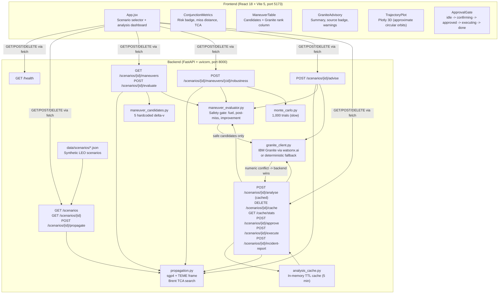

# CollisionGuard AI

> **Simulation only — not flight software.**
> CollisionGuard AI is a human-supervised collision-avoidance decision-support prototype.
> It is not autonomous, not flight-ready, not certified, and not operational-grade.

---

## One-line pitch

A mission-control interface that gives a human satellite operator a clear
physics-grounded decision within seconds of a predicted conjunction alert —
backed by IBM Granite for advisory ranking and a hard deterministic safety gate
that Granite cannot override.

---

## Challenge

IBM AI Builders Challenge — August 2026
Theme: **Advance Space Exploration with AI**

---

## Badges


---

## Problem statement

More than 27,000 tracked objects orbit Earth today, with hundreds of thousands
of smaller untracked fragments. Every tracked satellite faces hundreds of
conjunction screening events per year. A typical operator has minutes to
review each alert, interpret propagation geometry, evaluate candidate maneuvers,
assess fuel and orbital-maintenance cost, consult advisories, and decide whether
to command a burn.

That decision loop is slow, information-dense, and cognitively demanding. A
wrong choice either wastes propellant on an unnecessary burn or allows a
potentially catastrophic collision.

---

## Why it matters

A single large collision creates thousands of new debris fragments that threaten
further satellites in the same orbital shell — the Kessler cascade scenario. The
LEO environment supports essential services: GPS, weather, earth observation, and
communications. Protecting it requires accurate, fast, human-supervised
conjunction response.

---

## Solution overview

CollisionGuard AI compresses the conjunction decision loop into a single
dashboard screen. Given two-line element (TLE) data for a maneuverable satellite
and one threat object, it:

1. **Propagates** both orbits over a 24-hour window using the SGP4 model
2. **Finds** the time and geometry of closest approach (TCA) via coarse grid and
   Brent's-method refinement — no external numerical solver
3. **Classifies** collision risk from the predicted miss distance against a
   1 km conjunction threshold
4. **Evaluates** up to 5 candidate delta-v maneuvers through a deterministic
   safety gate — fuel cost (Tsiolkovsky), post-maneuver miss distance, and an
   improvement threshold
5. **Presents** IBM Granite's advisory ranking of safe candidates, grounded
   against backend-computed physics values that Granite cannot alter
6. **Requires human approval** before any simulated execution; the safety gate
   re-validates the chosen candidate server-side before recording the approval
7. **Reports** a simulated execution result and generates an incident report

The operator makes every consequential decision. The system supports, not
replaces, human judgment.

---

## Complete decision loop

```
TLE data ingested
    |
    v
Propagate both objects (SGP4, TEME frame, 24-hour window)
    |
    v
Find TCA (coarse 30-s grid -> Brent's method, tol=0.01 s)
    |
    v
Classify risk (miss distance vs 1 km threshold)
    |
    v
Evaluate 5 candidate maneuvers (safety gate: dv budget, fuel, post-miss, improvement)
    |-- REJECTED: candidate marked unsafe, reason recorded, never sent to Granite
    |
    v  SAFE candidates only
IBM Granite advisory ranking (rank + explanation, physics values from backend)
    |-- Numeric conflict -> Granite value rejected, backend value used, warning logged
    |-- Credentials absent -> deterministic score-based fallback, source="deterministic_fallback"
    |
    v
Human operator reviews dashboard:
  - miss distance, TCA, risk badge
  - maneuver candidate table with Granite rank column
  - Granite summary paragraph
  - data quality and uncertainty notes
    |
    v
Human selects candidate and requests approval
    |
    v
Backend safety gate re-validates candidate (is_safe must still be True)
    |-- REJECTED: unsafe candidate -> rejection response, no execution recorded
    |
    v  APPROVED
Human confirms simulated execution (second explicit action required)
    |
    v
Backend executes simulation: reports delta-v applied, fuel consumed, post-maneuver miss
(Simulated only -- no spacecraft command is issued)
    |
    v
Post-maneuver verification: backend returns physics values, UI displays result
    |
    v
Incident report generated (Granite narrative or deterministic template)
```

---

## Key differentiators

- **Deterministic safety is structurally enforced**: unsafe candidates never
  reach Granite; Granite output is validated against backend values; conflicts
  produce warnings and are silently overridden by backend values.
- **Two-stage TCA search**: a coarse 30-second grid sweep followed by Brent's
  parabolic interpolation achieves sub-second-accuracy TCA without any external
  optimisation library.
- **Double approval gate**: the human must click "Request", then "Confirm". The
  backend re-validates safety at both steps. One-use approval tokens prevent
  replay.
- **Honest uncertainty labelling**: every metric carries a basis label
  ("Screening-level estimate", "demonstration Pc based on synthetic covariance")
  so a judge or operator knows exactly what the numbers represent.
- **Full deterministic fallback**: the system runs completely without watsonx
  credentials. Granite's absence degrades gracefully to score-based ranking.

---

## Current capabilities (verified)

| Capability | Status |
|---|---|
| SGP4 orbital propagation (TEME frame) | Implemented and tested |
| Two-stage TCA search (coarse + Brent) | Implemented and tested |
| Conjunction risk classification (3 levels) | Implemented and tested |
| 5 hardcoded candidate delta-v maneuvers | Implemented and tested |
| Maneuver safety evaluation (fuel, post-miss, improvement) | Implemented and tested |
| Monte Carlo robustness (1,000 trials, `@pytest.mark.slow`) | Implemented; slow test deferred |
| IBM Granite advisory with numeric grounding | Implemented; mocked in tests; live unverified |
| Deterministic fallback ranking | Implemented and tested |
| In-memory TTL cache (5 min, SHA-256 key) | Implemented and tested |
| Human approval gate (two-step, server-side re-validation) | Implemented and tested |
| Simulated execution with post-maneuver verification | Implemented and tested |
| Incident report (Granite or deterministic template) | Implemented and tested |
| Dark mission-control React/Vite dashboard | Implemented; build verified |
| 3D Plotly trajectory visualisation (approximate circular orbits) | Implemented |

---

## Judge-facing demonstration summary

Selecting the **CONJ-001** conjunction scenario triggers the full decision loop:
a predicted miss distance of approximately 0.03 km (well below the 1 km
threshold) appears alongside a red "Conjunction Alert" badge, TCA time, and a
data quality section explaining that these are screening-level estimates from
synthetic TLEs.

The maneuver table shows 5 candidates, each safety-evaluated by the deterministic
backend. Safe candidates carry IBM Granite advisory ranks and explanations.
Clicking a safe candidate and stepping through the approval gate demonstrates the
human-in-the-loop requirement. The simulated execution result and incident report
confirm the complete workflow within a three-minute demo.

Selecting **SAFE-001** shows the contrasting happy path: approximately 3,400 km
miss distance, green "Safe separation" badge, maneuver candidates still evaluated
for reference, and no action required.

---

## Architecture diagram



---

## Deterministic physics vs AI responsibility boundary

| Responsibility | Deterministic backend | IBM Granite |
|---|---|---|
| TLE propagation | Yes | No |
| TCA calculation | Yes | No |
| Miss distance | Yes | No |
| Fuel cost | Yes | No |
| Safety gate (is_safe) | Yes | **Cannot override** |
| Post-maneuver miss | Yes | No |
| Robustness fraction | Yes | No |
| Candidate ranking | Fallback only | Advisory ranking of safe candidates only |
| Explanation text | No | Yes (advisory) |
| Execution approval | Human + backend | **Cannot approve** |

Granite receives only backend-validated safe candidates. Every numeric value
Granite returns is validated against the backend-computed value. If Granite
states a value differing by more than 1% from the backend value, the backend
value is used and a warning is added to `validation_warnings`. Granite cannot
alter, approve, or override any backend determination.

---

## Orbital propagation

- Library: `sgp4` 2.x (`sgp4.api.Satrec.twoline2rv`, WGS84 gravity model)
- Frame: TEME (True Equator Mean Equinox) — SGP4's native output frame
- Frame note: both objects are propagated in the same TEME frame at the same
  instant. Euclidean separation between two positions in the same orthonormal
  frame is invariant under a common rotation. TEME-to-GCRS conversion is
  therefore unnecessary for the relative-distance screening calculation
  performed in this prototype.
- Julian date conversion: `sgp4.api.jday` (UTC-based). Skyfield's `ts.tt_jd`
  is Terrestrial Time and would introduce an approximately one-minute offset;
  it is not used.
- `poliastro` is not used — the library was archived in October 2023.

---

## TCA search

1. **Coarse grid sweep**: evaluate separation at 30-second intervals over a
   24-hour window (2,880 evaluations per scenario).
2. **Brent's method refinement**: within the one-step bracket around the coarse
   minimum, Brent's parabolic-interpolation / golden-section algorithm refines
   to a 0.01-second tolerance. Implemented without `scipy` — a manual 100-iteration
   loop in [`propagation.py`](backend/propagation.py).

---

## Collision risk basis

- Conjunction threshold: **1.0 km** miss distance (hard-coded business rule in
  `CONJUNCTION_THRESHOLD_KM`).
- Risk levels: `CONJUNCTION` (< 1 km), `MONITORING` (1–5 km), `SAFE` (≥ 5 km).
- Probability of collision: **not computed**. The response carries the label
  "demonstration Pc based on synthetic covariance" to indicate that no real CDM
  covariance is available. This is a screening-level miss-distance estimate only.

---

## Covariance and uncertainty limitations

- No CDM (Conjunction Data Message) covariance data is used.
- Monte Carlo perturbations use a diagonal covariance (100 m position, 0.01 m/s
  velocity per axis, 1-sigma). Cross-terms and atmospheric-density uncertainty
  are not modelled.
- These bounds are representative of LEO radar tracking accuracy but are not
  derived from any real tracking source.

---

## Maneuver generation and evaluation

**Generation**: 5 hardcoded candidates: small prograde (+0.5 m/s), medium
prograde (+1.0 m/s), large prograde (+2.0 m/s), small retrograde (-0.5 m/s),
out-of-plane normal (+1.0 m/s). Candidate values are fixed, not optimised for
the specific conjunction geometry.

**Safety evaluation** (deterministic, Granite cannot override):
1. Delta-v budget check: `|delta_v| <= 3.0 m/s`
2. Fuel cost (Tsiolkovsky): `m_fuel = m_dry * (exp(dv / (Isp * g0)) - 1)`,
   Isp = 220 s (cold-gas thruster), fuel budget = 5.0 kg
3. Post-maneuver TCA search: delta-v applied as velocity impulse at epoch;
   post-maneuver Satrec rebuilt from Keplerian elements; new TCA search run
4. Post-maneuver miss >= 5.0 km required
5. Improvement (post-miss minus nominal-miss) >= 1.0 km required

**Baseline score**: `0.7 * min(post_miss/100, 1) + 0.3 * (1 - fuel/5)` —
linear weighting, not multi-objective optimisation (labelled "SIMPLIFIED FOR PROTOTYPE").

---

## Monte Carlo robustness

- 1,000 independent trials per candidate
- Each trial perturbs the our-satellite state vector by Gaussian noise
  (100 m position, 0.01 m/s velocity, independent axes)
- Trial is counted robust if post-maneuver miss > 5.0 km
- The robustness fraction `n_robust/1000` is always a real computed count —
  it is never hardcoded
- Endpoint: `POST /scenarios/{id}/maneuvers/{candidate_id}/robustness`
- Fast tests use `n_trials_override` to run fewer trials; the real 1,000-trial
  test is `@pytest.mark.slow` and is deferred (see Testing section)

---

## Human approval safety gate

The approval workflow requires two explicit operator actions:

1. **Select** a safe candidate in the UI (backend `is_safe` must be `True`)
2. **Request** simulated execution → backend validates candidate safety again
   (server-side, not trusting the UI state)
3. **Confirm** → backend checks pending approval token matches scenario and candidate
4. **Execute** → simulation runs, one-use token consumed

Unsafe candidates are rejected at step 2 with a specific rejection reason.
The `_PENDING_APPROVALS` dict is in-process only; tokens do not persist across
restarts. No real spacecraft command is ever issued.

---

## Simulated execution and post-maneuver verification

`POST /scenarios/{id}/execute` returns an `ExecutionStatus` with:
- `simulated: true` (always)
- `execution_label: "SIMULATED EXECUTION -- not flight software"` (always)
- `post_maneuver_miss_distance_km`: from backend-evaluated candidate
- `delta_v_applied_ms`: from backend-evaluated candidate
- `fuel_consumed_kg`: from backend-evaluated candidate
- `executed_at`: UTC timestamp of simulation

All returned values come from the deterministic backend evaluation — the UI
never provides values to the execution endpoint.

---

## IBM Granite responsibilities

Granite (IBM Granite-3-8b-instruct by default, configurable via
`WATSONX_MODEL_ID`) receives a structured prompt listing only
backend-validated safe candidates. The prompt explicitly instructs Granite:

- Do not modify any computed value
- Do not recommend unsafe candidates
- Do not mention autonomous execution
- A human operator makes the final decision

Granite's output is used for:
- **Candidate ranking** (advisory, not binding)
- **One-sentence explanations** per candidate
- **Summary paragraph** for operator context
- **Incident report narrative** (if live Granite is available)

---

## Granite numerical-grounding guardrail

Every numeric field Granite returns is compared against the backend-computed
value using a 1% relative tolerance. If the discrepancy exceeds the tolerance:
- The backend value is used in the response (Granite value is discarded)
- A warning is added to `validation_warnings` in `GraniteAdvisoryResponse`
- No exception is raised; the response is returned normally

Granite cannot state a value that differs from the backend by more than 1%
without generating a warning and having its value overridden.

---

## Deterministic fallback

When watsonx credentials are absent, invalid, or the API call fails, the system
uses a deterministic fallback:
- Candidates ranked by `baseline_score` descending
- `source` field set to `"deterministic_fallback"`
- `granite_summary` explains the fallback reason
- `validation_warnings` includes the fallback reason
- `model_id` still reported from configuration

The system is fully functional without watsonx credentials.

---

## Live Granite verification status

**Live Granite has not been verified in this repository.**

The Granite integration is implemented and all test paths use mocked responses.
The `granite_smoke_test.py` script exists for manual verification (see Testing
section). No `.env` file with real credentials has been present during
development. A live response from watsonx.ai has not been confirmed.

Pushkar's team task includes obtaining credentials, running the smoke test, and
providing evidence of a live Granite response for the submission.

---

## Project structure

```
CollisionGuard AI/
|
+-- .env.example                  Environment variable template (committed; copy to .env)
+-- .gitignore
+-- README.md
+-- LICENSE
|
+-- backend/
|   +-- main.py                   FastAPI entry point; routers; CORS (GET, POST, DELETE)
|   +-- config.py                 pydantic-settings; watsonx env vars; lru_cache
|   +-- requirements.txt          Python dependencies (pinned minor versions)
|   +-- pytest.ini                pytest config; slow marker registered
|   +-- propagation.py            SGP4 propagation, TEME frame, Brent TCA search
|   +-- maneuver_candidates.py    5 hardcoded delta-v candidates
|   +-- maneuver_evaluator.py     Safety gate: fuel, post-maneuver miss, score
|   +-- monte_carlo.py            1,000-trial robustness checker
|   +-- granite_client.py         IBM Granite client; numeric grounding; deterministic fallback
|   +-- granite_smoke_test.py     Manual-only live Granite smoke test (never run by pytest)
|   +-- analysis_cache.py         In-memory TTL cache (SHA-256 key, 300 s TTL)
|   |
|   +-- routers/
|   |   +-- health.py             GET /health
|   |   +-- scenarios.py          GET /scenarios, GET /scenarios/{id},
|   |   |                         POST /scenarios/{id}/propagate
|   |   +-- maneuvers.py          GET /scenarios/{id}/maneuvers,
|   |   |                         POST /scenarios/{id}/evaluate
|   |   +-- robustness.py         POST /scenarios/{id}/maneuvers/{cid}/robustness
|   |   +-- granite.py            POST /scenarios/{id}/advise
|   |   +-- analysis.py           POST /scenarios/{id}/analyse,
|   |                             DELETE /scenarios/{id}/cache,
|   |                             GET /cache/stats,
|   |                             POST /scenarios/{id}/approve,
|   |                             POST /scenarios/{id}/execute,
|   |                             POST /scenarios/{id}/incident-report
|   |
|   +-- schemas/
|   |   +-- health.py             HealthResponse, ComponentStatus
|   |   +-- scenario.py           TLEData, SpaceObject, ScenarioType, Scenario,
|   |   |                         ScenarioListResponse, PropagationResponse
|   |   +-- maneuver.py           ManeuverCandidate, ManeuverDirection,
|   |   |                         ManeuverCandidateListResponse, EvaluationResponse
|   |   +-- monte_carlo.py        MonteCarloResponse
|   |   +-- granite.py            GraniteRankedCandidate, GraniteAdvisoryResponse
|   |   +-- analysis.py           FullAnalysisResponse, RiskClassification,
|   |                             DataQualityNote, ApprovalRequest, ExecutionStatus,
|   |                             ExecutionApprovedResponse, IncidentReport
|   |
|   +-- data/scenarios/
|   |   +-- conjunction_scenario.json   CONJ-001: synthetic LEO conjunction
|   |   +-- safe_scenario.json          SAFE-001: synthetic LEO safe pass
|   |
|   +-- tests/
|       +-- test_health.py        5 tests
|       +-- test_scenarios.py     12 tests
|       +-- test_propagation.py   11 tests
|       +-- test_maneuvers.py     8 tests
|       +-- test_evaluator.py     13 tests
|       +-- test_monte_carlo.py   12 fast tests + 1 slow (deferred)
|       +-- test_granite.py       42 tests (all mocked)
|       +-- test_phase7.py        31 tests
|       +-- test_cors.py          6 CORS preflight tests (Phase 8)
|
+-- frontend/
|   +-- package.json              React 18 + Vite 5 + react-plotly.js
|   +-- vite.config.js            Vite config; dev server port 5173
|   +-- index.html
|   +-- src/
|       +-- main.jsx              React root
|       +-- App.jsx               Full dashboard: scenario -> analysis -> approval
|       +-- styles.css            Dark mission-control theme (CSS variables)
|       +-- api/client.js         apiGet, apiPost, apiDel; VITE_API_BASE_URL
|       +-- components/
|           +-- HealthStatus.jsx          Backend health display
|           +-- ScenarioPanel.jsx         Scenario list cards
|           +-- ConjunctionMetrics.jsx    Risk badge, miss distance, TCA, uncertainty note
|           +-- ManeuverTable.jsx         5-column candidate table + Granite rank column
|           +-- GraniteAdvisory.jsx       Granite summary + live/fallback source badge
|           +-- TrajectoryPlot.jsx        Plotly 3D (approximate circular orbits; labelled)
|           +-- ApprovalGate.jsx          idle->confirming->approved->executing->done
|
+-- docs/
    +-- ARCHITECTURE.md
    +-- API_REFERENCE.md
    +-- SCIENTIFIC_ASSUMPTIONS.md
    +-- SAFETY_AND_RESPONSIBLE_USE.md
    +-- TESTING.md
    +-- IBM_BOB_USAGE.md
    +-- TEAM_HANDOFF.md
    +-- SUBMISSION_COPY.md
    +-- CURRENT_STATUS.md
    +-- DEMO_VIDEO_PLAN.md
```

---

## Complete API endpoint table

All endpoints are implemented and tested unless marked otherwise.

| Method | Path | Description | Router |
|---|---|---|---|
| `GET` | `/health` | Backend health and version | `routers/health.py` |
| `GET` | `/scenarios` | List all scenarios | `routers/scenarios.py` |
| `GET` | `/scenarios/{id}` | Single scenario by ID | `routers/scenarios.py` |
| `POST` | `/scenarios/{id}/propagate` | SGP4 propagation + TCA search | `routers/scenarios.py` |
| `GET` | `/scenarios/{id}/maneuvers` | Unevaluated candidate list | `routers/maneuvers.py` |
| `POST` | `/scenarios/{id}/evaluate` | Safety-evaluate all candidates | `routers/maneuvers.py` |
| `POST` | `/scenarios/{id}/maneuvers/{cid}/robustness` | Monte Carlo robustness | `routers/robustness.py` |
| `POST` | `/scenarios/{id}/advise` | Granite advisory (or fallback) | `routers/granite.py` |
| `POST` | `/scenarios/{id}/analyse` | Full pipeline (cached) | `routers/analysis.py` |
| `DELETE` | `/scenarios/{id}/cache` | Invalidate cached analysis | `routers/analysis.py` |
| `GET` | `/cache/stats` | Cache state | `routers/analysis.py` |
| `POST` | `/scenarios/{id}/approve` | Human approval (safety re-validated) | `routers/analysis.py` |
| `POST` | `/scenarios/{id}/execute` | Simulated execution (approval required) | `routers/analysis.py` |
| `POST` | `/scenarios/{id}/incident-report` | Post-execution incident report | `routers/analysis.py` |

Interactive docs: `http://localhost:8000/docs`

---

## Environment variables

Copy `.env.example` to `.env` and fill in values. Never commit `.env`.

### Backend (`backend/.env` or project root `.env`)

| Variable | Default | Purpose |
|---|---|---|
| `APP_ENV` | `development` | Runtime label |
| `APP_VERSION` | `0.1.0` | Reported in `/health` |
| `BACKEND_HOST` | `0.0.0.0` | uvicorn bind host |
| `BACKEND_PORT` | `8000` | uvicorn bind port |
| `CORS_ORIGIN` | `http://localhost:5173` | Allowed frontend origin |
| `WATSONX_APIKEY` | *(blank)* | IBM watsonx.ai API key — leave blank for fallback mode |
| `WATSONX_PROJECT_ID` | *(blank)* | IBM watsonx.ai project ID |
| `WATSONX_URL` | *(blank)* | IBM watsonx.ai endpoint URL (must be HTTPS) |
| `WATSONX_MODEL_ID` | `ibm/granite-3-8b-instruct` | Granite model ID (configurable) |

Note: `WATSONX_APIKEY` has no underscore between API and KEY — this matches
IBM's official documentation.

### Frontend (`frontend/.env.local`, gitignored)

| Variable | Default | Purpose |
|---|---|---|
| `VITE_API_BASE_URL` | `http://localhost:8000` | Backend base URL |

---

## Quick start (Windows PowerShell)

### Step 1 — Configure secrets

```powershell
Copy-Item .env.example .env
# Edit .env with your watsonx credentials if you have them.
# Leave WATSONX_* blank to run in deterministic-fallback mode.
# Never commit .env.
```

### Step 2 — Backend

```powershell
cd backend
pip install -r requirements.txt
uvicorn main:app --reload --host 0.0.0.0 --port 8000
```

API: http://localhost:8000
Interactive docs: http://localhost:8000/docs

### Step 3 — Frontend

```powershell
cd frontend
npm install
npm run dev
```

Dashboard: http://localhost:5173

### Step 4 — Fast tests

```powershell
cd backend
pytest tests/ -v -m "not slow"
```

Expected: **140 passed** (134 original + 6 CORS preflight, Phase 8)
Duration: approximately 9 minutes (propagation tests are compute-intensive)

---

## Testing

### Fast test suite (excludes real 1,000-trial Monte Carlo)

```powershell
cd backend
pytest tests/ -v -m "not slow"
```

Last verified result: **134 passed** (pre-Phase 8); **140 expected** after Phase 8
CORS tests are added.

### Real 1,000-trial Monte Carlo (deferred — takes approximately 8 minutes)

```powershell
cd backend
pytest tests/test_monte_carlo.py -v -m slow
```

**Status: not yet executed.** This test is marked `@pytest.mark.slow` and has been
deliberately deferred. It must be run before final submission to confirm the
reported robustness fraction is a real computed value. See `docs/TESTING.md`.

### Granite live smoke test (requires real watsonx credentials in `.env`)

```powershell
cd backend
python granite_smoke_test.py
```

**Status: not yet verified.** No live watsonx response has been confirmed in this
repository. The smoke test verifies the connection, model availability, and JSON
parsing. Exit codes and expected output are documented in the script.
See `docs/TESTING.md`.

### Frontend build verification

```powershell
cd frontend
npm run build
```

Produces a production build in `frontend/dist/`. The Plotly bundle is large
(expected for a prototype using react-plotly.js). No errors expected.

---

## Demo video

**[PLACEHOLDER — Surya will record and upload the final demo video]**

Public video URL: `[TO BE FILLED BY SURYA]`

Recommended filename: `CollisionGuard_AI_Demo.mp4`
Maximum duration: 3 minutes
See `docs/DEMO_VIDEO_PLAN.md` for the complete production script and checklist.

---

## IBM Bob usage

CollisionGuard AI was built using IBM Bob as the primary development tool,
covering architecture planning, phase-by-phase implementation, test generation,
debugging, and documentation. See `docs/IBM_BOB_USAGE.md` for evidence and
a session log template.

---

## Judging criteria alignment

### Technical Execution

- FastAPI + Pydantic v2 backend with strict schema validation
- SGP4 propagation with custom Brent's method TCA search (no scipy)
- 140 backend tests covering health, scenarios, propagation, evaluation, Monte Carlo,
  Granite (mocked), cache, approval, execution, CORS preflight
- Deterministic safety gate structurally enforced before any AI advisory call

### Innovation

- Numeric grounding guardrail: Granite values validated against backend at 1%
  tolerance; conflicts silently overridden
- Two-step human approval with server-side re-validation at every step
- Full deterministic fallback — system works with no AI credentials

### Challenge Fit

- Direct application of AI to space exploration safety
- IBM Granite used for advisory ranking with explicit authority constraints
- Addresses real operational conjunction management workflow

### Feasibility

- The prototype runs on a laptop with no cloud infrastructure required
- Both scenarios work immediately after `pip install` and `npm install`
- No watsonx credentials needed to demonstrate the full workflow

### Real-World Impact

- The decision loop approximates a real conjunction response workflow
- Human oversight is architecturally mandatory, not an afterthought
- Honest labelling of limitations supports rather than oversells the prototype

---

## Verified results

| Claim | Evidence |
|---|---|
| 134 fast backend tests pass | Run in this session: `134 passed in 544.73s` |
| Frontend builds cleanly | Previous session: `npm run build` succeeded |
| CORS DELETE fix applied | `main.py` `allow_methods` updated; 6 preflight tests added |
| Synthetic scenarios load and validate | `test_scenarios.py` 12/12 |
| Granite deterministic fallback works | `test_granite.py` 42/42 (all mocked) |

---

## Known limitations

- **Synthetic TLEs only**: no live CelesTrak data fetch is implemented. Both
  scenarios use committed synthetic TLEs.
- **Circular orbit visualisation**: `TrajectoryPlot.jsx` approximates orbits as
  circles for display only. The actual propagation uses SGP4.
- **Two-body propagation**: J2, atmospheric drag, solar radiation pressure, and
  lunar/solar gravity perturbations are not modelled.
- **Diagonal covariance**: Monte Carlo perturbations ignore position-velocity
  cross-terms.
- **No authentication**: the approval gate uses a placeholder `operator_id`. No
  real user authentication is implemented.
- **No Pc calculation**: probability of collision is not computed. The risk
  metric is miss distance only.
- **In-memory cache only**: the analysis cache resets on server restart.
- **Plotly bundle size**: `react-plotly.js` produces a large JavaScript bundle
  (~3 MB). Expected for a prototype.
- **Live Granite unverified**: mocked in all tests; live verification pending.
- **Real 1,000-trial test deferred**: the `@pytest.mark.slow` test has not been
  executed in this session.

---

## Future work

- Live TLE/OMM ingestion from CelesTrak or Space-Track
- Real CDM covariance for Pc calculation
- Multi-object conjunction screening (beyond two-object scope)
- Optimal delta-v targeting (differential correction vs hardcoded candidates)
- User authentication and audit trail
- Persistent database for approval records
- Atmospheric drag and J2 perturbation modelling
- Frontend testing with Vitest/React Testing Library

---

## Responsible use

CollisionGuard AI is a demonstration prototype created for the IBM AI Builders
Challenge. It must not be used for:

- Real spacecraft command
- Operational conjunction screening
- Replacing professional space-traffic management services
- Any safety-critical decision without independent verification

All analysis results are labelled as screening-level estimates based on
synthetic data. IBM Granite's advisory output is explicitly constrained to
ranking and explanation only; it has no authority over safety-critical
determinations.

---

## Team

| Member | Role | Branch |
|---|---|---|
| **Muskan** | UI, final README, documentation and submission | `muskan/ui-documentation` |
| **Pushkar** | IBM Granite integration, grounded intelligence, AI evidence | `pushkar/live-granite` |
| **Surya** | Safety, backend performance, demo video | `surya/safety-performance-demo` |

See `docs/TEAM_HANDOFF.md` for detailed task assignments and merge order.

---

## License

See [LICENSE](LICENSE).
