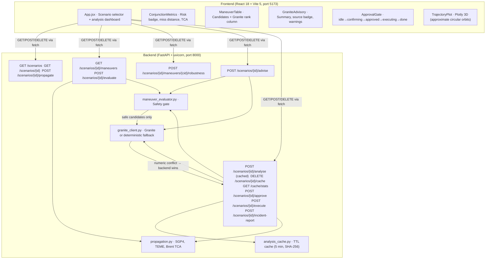

# CollisionGuard AI

> **Simulation only — not flight software.**
> CollisionGuard AI is a human-supervised collision-avoidance decision-support prototype.
> It is not autonomous, not flight-ready, not certified, and not operational-grade.

---

## One-line pitch

A mission-control interface that gives a human satellite operator a clear
physics-grounded decision within seconds of a predicted conjunction alert —
backed by IBM Granite for advisory ranking and a hard deterministic safety gate
that Granite cannot override.

---

## Challenge

IBM AI Builders Challenge — August 2026  
Theme: **Advance Space Exploration with AI**

---

## Badges


---

## Problem statement

More than 27,000 tracked objects orbit Earth, with hundreds of thousands of
untracked fragments. Each tracked satellite faces hundreds of conjunction
screening events per year. A typical operator has minutes to review propagation
geometry, evaluate maneuver candidates, assess fuel cost, and decide whether to
command a burn — a slow, information-dense, cognitively demanding process.

---

## Solution overview

CollisionGuard AI compresses the conjunction decision loop into a single
dashboard screen. Given TLE data for a maneuverable satellite and one threat
object, it:

1. **Propagates** both orbits over a 24-hour window using the SGP4 model (TEME frame)
2. **Finds** TCA via coarse 30-second grid sweep followed by Brent's-method
   refinement (tol = 0.01 s) — no external numerical solver
3. **Classifies** collision risk against a 1 km conjunction threshold
4. **Evaluates** up to 5 candidate delta-v maneuvers through a deterministic
   safety gate (fuel cost via Tsiolkovsky, post-maneuver miss, improvement threshold)
5. **Presents** IBM Granite's advisory ranking of safe candidates, grounded
   against backend physics values that Granite cannot alter
6. **Requires human approval** before any simulated execution; the safety gate
   re-validates the chosen candidate server-side
7. **Reports** a simulated execution result and incident report

The operator makes every consequential decision.

---

## Complete decision loop

```
TLE data ingested
    |
    v
Propagate both objects (SGP4, TEME frame, 24-hour window)
    |
    v
Find TCA (coarse 30-s grid → Brent's method, tol=0.01 s)
    |
    v
Classify risk (miss distance vs 1 km threshold)
    |
    v
Evaluate 5 candidate maneuvers (safety gate: dv budget, fuel, post-miss, improvement)
    |-- REJECTED: candidate marked unsafe, reason recorded, never sent to Granite
    |
    v  SAFE candidates only
IBM Granite advisory ranking (rank + explanation, physics values from backend)
    |-- Numeric conflict → Granite value rejected, backend value used, warning logged
    |-- Credentials absent → deterministic score-based fallback, source="deterministic_fallback"
    |
    v
Human operator reviews dashboard: miss distance, TCA, risk badge, maneuver table, advisory
    |
    v
Human selects candidate → backend safety gate re-validates (is_safe must be True)
    |-- REJECTED: unsafe candidate → rejection response, no execution recorded
    |
    v  APPROVED
Human confirms simulated execution (second explicit action required)
    |
    v
Backend executes simulation: delta-v applied, fuel consumed, post-maneuver miss reported
(Simulated only — no spacecraft command is issued)
    |
    v
Incident report generated (Granite narrative or deterministic template)
```

---

## Architecture



---

## Key differentiators

- **Deterministic safety structurally enforced** — unsafe candidates never reach
  Granite; Granite output validated at 1% tolerance; conflicts silently overridden
- **Two-stage TCA search** — coarse 30-second grid + Brent's parabolic interpolation
  achieves sub-second-accuracy TCA without scipy
- **Double approval gate** — human clicks Request then Confirm; backend
  re-validates safety at both steps; one-use tokens prevent replay
- **Full deterministic fallback** — system runs completely without watsonx credentials

---

## Deterministic physics vs Granite boundary

| Responsibility | Deterministic backend | IBM Granite |
|---|---|---|
| SGP4 propagation, TCA, miss distance | Yes | No |
| Fuel cost (Tsiolkovsky) | Yes | No |
| Safety gate (`is_safe`) | Yes | **Cannot override** |
| Post-maneuver miss, robustness | Yes | No |
| Candidate ranking | Fallback only | Advisory (safe candidates only) |
| Explanation text | No | Yes (advisory) |
| Execution approval | Human + backend | **Cannot approve** |

Granite receives only backend-validated safe candidates. Every numeric value
Granite returns is validated against the backend-computed value at 1% tolerance.
Conflicts are silently overridden; a warning is added to `validation_warnings`.

See [`docs/ARCHITECTURE.md`](docs/ARCHITECTURE.md) for full detail.

---

## Implemented capabilities (verified)

| Capability | Status |
|---|---|
| SGP4 propagation (TEME frame) | Implemented and tested |
| Two-stage TCA search (coarse + Brent, tol=0.01 s) | Implemented and tested |
| Conjunction risk classification (3 levels, 1 km threshold) | Implemented and tested |
| 5 hardcoded candidate delta-v maneuvers | Implemented and tested |
| Maneuver safety evaluation (fuel, post-miss, improvement) | Implemented and tested |
| Monte Carlo robustness (1,000 trials, `@pytest.mark.slow`) | Implemented; **slow test deferred** |
| IBM Granite advisory with numeric grounding | Implemented; mocked in tests; **live unverified** |
| Deterministic fallback ranking | Implemented and tested |
| In-memory TTL cache (5 min, SHA-256 key) | Implemented and tested |
| Human approval gate (two-step, server-side re-validation) | Implemented and tested |
| Simulated execution + post-maneuver verification | Implemented and tested |
| Incident report (Granite or deterministic template) | Implemented and tested |
| Dark mission-control React/Vite dashboard | Implemented; build verified |
| 3D Plotly trajectory visualisation (approximate circular orbits) | Implemented |

---

## API summary

Full schema documentation: [`docs/API_REFERENCE.md`](docs/API_REFERENCE.md)

| Method | Path | Description |
|---|---|---|
| `GET` | `/health` | Backend health and version |
| `GET` | `/scenarios` | List all scenarios |
| `GET` | `/scenarios/{id}` | Single scenario by ID |
| `POST` | `/scenarios/{id}/propagate` | SGP4 propagation + TCA search |
| `GET` | `/scenarios/{id}/maneuvers` | Unevaluated candidate list |
| `POST` | `/scenarios/{id}/evaluate` | Safety-evaluate all candidates |
| `POST` | `/scenarios/{id}/maneuvers/{cid}/robustness` | Monte Carlo robustness |
| `POST` | `/scenarios/{id}/advise` | Granite advisory (or deterministic fallback) |
| `POST` | `/scenarios/{id}/analyse` | Full pipeline (cached) |
| `DELETE` | `/scenarios/{id}/cache` | Invalidate cached analysis |
| `GET` | `/cache/stats` | Cache state |
| `POST` | `/scenarios/{id}/approve` | Human approval (safety re-validated) |
| `POST` | `/scenarios/{id}/execute` | Simulated execution (approval required) |
| `POST` | `/scenarios/{id}/incident-report` | Post-execution incident report |

Interactive docs: `http://localhost:8000/docs`

---

## Project structure

```
CollisionGuard AI/
├── .env.example                  Environment variable template
├── .gitignore
├── README.md
├── LICENSE
├── backend/
│   ├── main.py                   FastAPI entry point; routers; CORS (GET, POST, DELETE)
│   ├── config.py                 pydantic-settings; watsonx env vars; lru_cache
│   ├── requirements.txt
│   ├── pytest.ini
│   ├── propagation.py            SGP4, TEME frame, Brent TCA search
│   ├── maneuver_candidates.py    5 hardcoded delta-v candidates
│   ├── maneuver_evaluator.py     Safety gate: fuel, post-maneuver miss, score
│   ├── monte_carlo.py            1,000-trial robustness checker
│   ├── granite_client.py         Granite client; numeric grounding; deterministic fallback
│   ├── granite_smoke_test.py     Manual-only live Granite smoke test
│   ├── analysis_cache.py         In-memory TTL cache (SHA-256, 300 s TTL)
│   ├── routers/                  health, scenarios, maneuvers, robustness, granite, analysis
│   ├── schemas/                  health, scenario, maneuver, monte_carlo, granite, analysis
│   ├── data/scenarios/           conjunction_scenario.json, safe_scenario.json
│   └── tests/                    140 fast tests across 9 files + 1 slow deferred
├── frontend/
│   ├── package.json              React 18 + Vite 5 + react-plotly.js
│   ├── vite.config.js
│   ├── src/
│   │   ├── App.jsx               Full dashboard
│   │   ├── api/client.js         apiGet, apiPost, apiDel; VITE_API_BASE_URL
│   │   └── components/           HealthStatus, ScenarioPanel, ConjunctionMetrics,
│   │                             ManeuverTable, GraniteAdvisory, TrajectoryPlot, ApprovalGate
└── docs/
    ├── ARCHITECTURE.md           Full system architecture
    ├── API_REFERENCE.md          Complete endpoint schemas
    ├── SCIENTIFIC_ASSUMPTIONS.md Propagation, TCA, covariance, Monte Carlo assumptions
    ├── SAFETY_AND_RESPONSIBLE_USE.md
    ├── TESTING.md                All test procedures and evidence requirements
    ├── IBM_BOB_USAGE.md          Bob session evidence
    ├── TEAM_HANDOFF.md           Per-member task assignments and merge order
    ├── SUBMISSION_COPY.md        Draft submission text
    ├── CURRENT_STATUS.md         Detailed status of every item
    └── DEMO_VIDEO_PLAN.md        3-minute script for Surya
```

---

## Quick start (Windows PowerShell)

```powershell
# 1 — Configure secrets
Copy-Item .env.example .env
# Edit .env — leave WATSONX_* blank for deterministic-fallback mode. Never commit .env.

# 2 — Backend
cd backend
pip install -r requirements.txt
uvicorn main:app --reload --host 0.0.0.0 --port 8000
# API: http://localhost:8000   Docs: http://localhost:8000/docs

# 3 — Frontend (new terminal)
cd frontend
npm install
npm run dev
# Dashboard: http://localhost:5173

# 4 — Fast tests
cd backend
pytest tests/ -v -m "not slow"
# Expected: 140 passed, 1 deselected (~7-9 min on this hardware)
```

---

## Environment variables

Copy `.env.example` to `.env`. Never commit `.env`.

| Variable | Default | Purpose |
|---|---|---|
| `APP_ENV` | `development` | Runtime label |
| `APP_VERSION` | `0.1.0` | Reported in `/health` |
| `BACKEND_HOST` | `0.0.0.0` | uvicorn bind host |
| `BACKEND_PORT` | `8000` | uvicorn bind port |
| `CORS_ORIGIN` | `http://localhost:5173` | Allowed frontend origin |
| `WATSONX_APIKEY` | *(blank)* | IBM watsonx.ai API key — blank = fallback mode |
| `WATSONX_PROJECT_ID` | *(blank)* | IBM watsonx.ai project ID |
| `WATSONX_URL` | *(blank)* | IBM watsonx.ai endpoint (must be HTTPS) |
| `WATSONX_MODEL_ID` | `ibm/granite-3-8b-instruct` | Granite model (configurable) |

Note: `WATSONX_APIKEY` has no underscore between API and KEY — matches IBM docs.

Frontend (`frontend/.env.local`, gitignored): `VITE_API_BASE_URL=http://localhost:8000`

---

## Test status

| Test suite | Status | Command |
|---|---|---|
| Fast backend tests (140 tests) | **140 passed, 1 deselected** · 452.95 s | `pytest tests/ -v -m "not slow"` |
| CORS preflight (6 tests) | **6 passed** · 1.51 s | `pytest tests/test_cors.py -v` |
| Frontend build | **Succeeded** · 1m 16s · Plotly chunk warning (expected) | `npm run build` |
| Real 1,000-trial Monte Carlo | **Not yet executed** — deferred; Surya owns | `pytest tests/test_monte_carlo.py -v -m slow` |
| Live Granite smoke test | **Not yet verified** — requires real credentials; Pushkar owns | `python granite_smoke_test.py` |

See [`docs/TESTING.md`](docs/TESTING.md) for full procedures and evidence requirements.

---

## Live Granite status

**Not verified in this repository.** The integration is fully implemented and
all 42 Granite tests pass with mocked responses. No live watsonx.ai response
has been confirmed. Pushkar's task is to obtain credentials, run the smoke test,
and provide evidence for submission.

---

## IBM Bob usage

CollisionGuard AI was built using IBM Bob as the primary development tool,
covering architecture, phase-by-phase implementation, test generation, debugging,
and documentation. See [`docs/IBM_BOB_USAGE.md`](docs/IBM_BOB_USAGE.md).

---

## Judging criteria alignment

| Criterion | Evidence |
|---|---|
| **Technical Execution** | FastAPI + Pydantic v2; SGP4 + Brent TCA; 140 tests; deterministic safety gate |
| **Innovation** | Numeric grounding guardrail at 1% tolerance; two-step approval with server-side re-validation; full deterministic fallback |
| **Challenge Fit** | Direct AI application to space safety; Granite with explicit authority constraints; real conjunction workflow |
| **Feasibility** | Runs on a laptop; no cloud required; both scenarios work after `pip install` + `npm install` |
| **Real-World Impact** | Approximates real conjunction response; human oversight architecturally mandatory; honest limitation labelling |

---

## Demo video

**[PLACEHOLDER — Surya will record and upload the final demo video]**

Public video URL: `[TO BE FILLED BY SURYA]`  
Maximum duration: 3 minutes  
See [`docs/DEMO_VIDEO_PLAN.md`](docs/DEMO_VIDEO_PLAN.md) for the full script.

---

## Scientific methodology

See [`docs/SCIENTIFIC_ASSUMPTIONS.md`](docs/SCIENTIFIC_ASSUMPTIONS.md) for:
- SGP4 frame and Julian date convention (jday UTC, not Skyfield tt_jd)
- TCA search parameters (30-second grid, Brent tol=0.01 s, 2,880 evaluations)
- Conjunction threshold (1.0 km, hard-coded)
- Monte Carlo covariance (100 m position, 0.01 m/s velocity, diagonal only)
- Maneuver generation (5 hardcoded candidates, not optimised for geometry)
- Baseline score formula (simplified linear weighting, labelled as such)

---

## Known limitations

- **Synthetic TLEs only** — no live CelesTrak data fetch
- **Circular orbit visualisation** — TrajectoryPlot approximates orbits as circles; SGP4 is used for all physics
- **Two-body propagation** — J2, drag, solar pressure, lunar/solar gravity not modelled
- **Diagonal covariance** — Monte Carlo ignores position-velocity cross-terms
- **No authentication** — approval gate uses placeholder `operator_id`
- **No Pc calculation** — risk metric is miss distance only
- **In-memory cache** — resets on server restart
- **Live Granite unverified** — mocked in all tests
- **Real 1,000-trial test deferred** — `@pytest.mark.slow`, not yet executed

---

## Future work

- Live TLE/OMM ingestion from CelesTrak or Space-Track
- Real CDM covariance for Pc calculation
- Multi-object conjunction screening
- Optimal delta-v targeting (differential correction)
- User authentication and persistent audit trail
- J2 and atmospheric drag perturbation modelling
- Frontend testing with Vitest/React Testing Library

---

## Responsible use

CollisionGuard AI must not be used for real spacecraft command, operational
conjunction screening, or any safety-critical decision without independent
verification. All results are screening-level estimates from synthetic data.
See [`docs/SAFETY_AND_RESPONSIBLE_USE.md`](docs/SAFETY_AND_RESPONSIBLE_USE.md).

---

## Team

| Member | Role |
|---|---|
| **Muskan** | UI, final README, documentation and submission |
| **Pushkar** | IBM Granite integration, live verification, grounded intelligence and AI evidence |
| **Surya** | Backend safety, performance, real 1,000-trial Monte Carlo, demo video |

See [`docs/TEAM_HANDOFF.md`](docs/TEAM_HANDOFF.md) for detailed task assignments and merge order.

---

## License

See [LICENSE](LICENSE).
